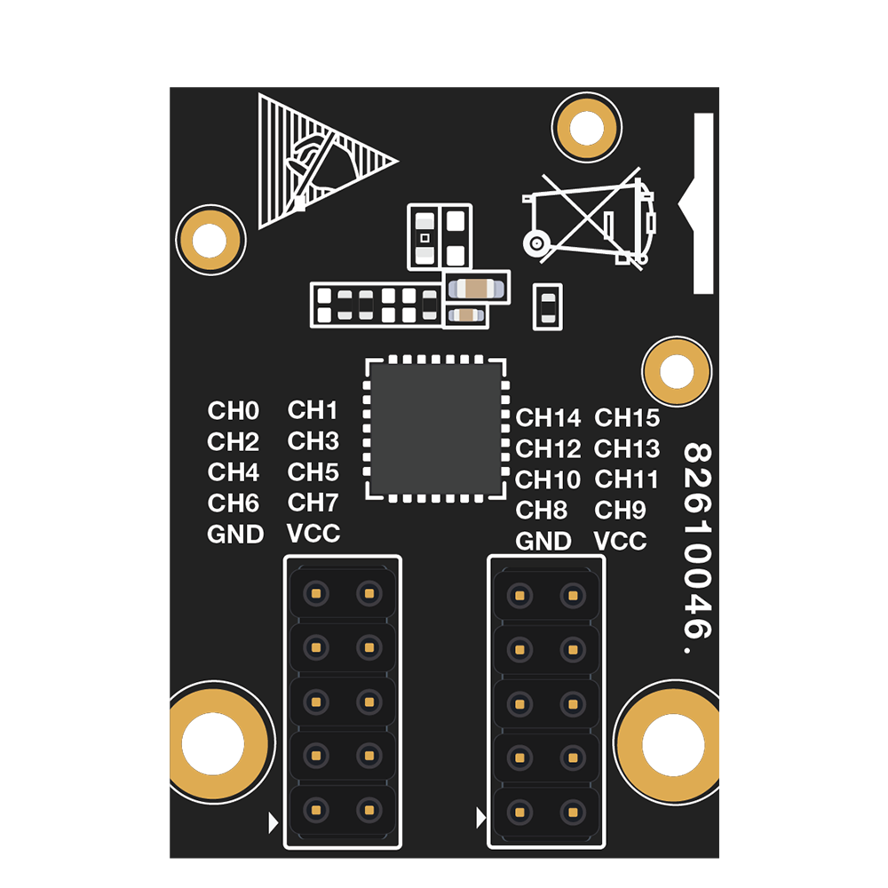

# Breathing LED using WisBlock PWM Expander Module RAK13004

[TOC]

## 1.Introduction

This guide explains how to use the [WisBlock PWM Expander RAK13004](https://store.rakwireless.com/products/pwm-expansion-module-rak13004) in combination with RAK6421 WisBlock Hat or RAK7391 WisGate Developer Connect to control breathing LED using Python.

### 1.1. RAK13004

The RAK13004 is a PWM expander module. It can be controlled 16-channel LED, and the module uses PCA9685 from NXP, I2C interface. For more information about RAK13004, refer to the [RAK13004 datasheet](https://docs.rakwireless.com/Product-Categories/WisBlock/RAK13004/Datasheet/#overview).



## 2.Hardware

### 2.1. Hardware required 

There are multiple hardware options to use RAK13004:

- Raspberry Pi + RAK6421 WisBlock Hat + RAK13004
- RAK7391 WisGate Developer Connect +  RAK6421 WisBlock Hat + RAK13004
- RAK7391 WisGate Developer Connect + RAK13004

The RAK13004 can be connected to the IO slot on the RAK6421 Pi Hat, and RAK6421 Pi Hat can be mounted to Raspberry Pi or RAK7391 through 40-pin header,  you also can mounted RAK13004 to WisBlock Connector on the RAK7391 directly.

### 2.2. Connection diagram

There are 16 PWM output channels on the RAK13004,  you can connect a LED to one of them.


## 3. Software

The example code can be found in the [rak13004_breath.py](rak13004_breath.py) file. In order to run this you will first have to install some required modules. The recommended way to do this is to use [virtualenv](https://virtualenv.pypa.io/en/latest/) to create a isolated environment. To install `virtualenv` you just have to:

```
sudo apt install virtualenv
```

Once installed you can create the environment and install the dependencies (run this on the `rak13004` folder):

```
virtualenv .env
source .env/bin/activate
pip install -r requirements.txt
```

Once installed you can run the example by typing:

```
python rak13004_breath.py
```

After that you can leave the virtual environment by typing `deactivate`. To activate the virtual environment again you just have to `source .env/bin/activate` and run the script. No need to install the dependencies again since they will be already installed in the virtual environment.
