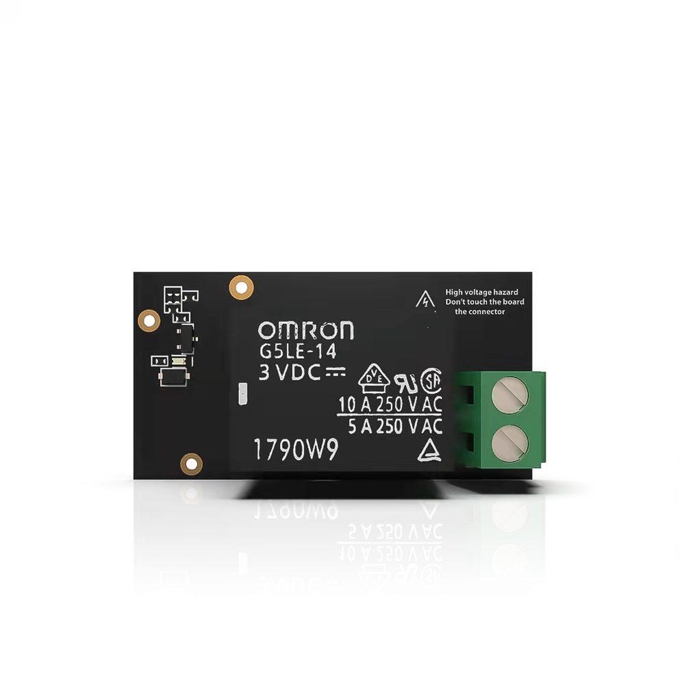
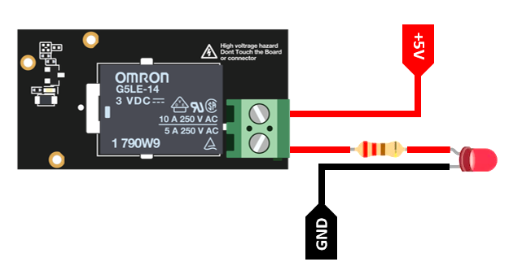

# Toggle a RAK13007 WisBlock Relay IO Module

[TOC]

## 1.Introduction

This guide explains how to use the [WisBlock IO RAK13007](https://docs.rakwireless.com/Product-Categories/WisBlock/RAK13007/Overview/) in combination with RAK6421 Wisblock Hat or RAK7391 WisGate Developer Connect to interface an Relay module device through Python. 

### 1.1 Relay

A **Relay** is an electrically operated switch. It consists of a set of input terminals for a single or multiple control signals, and a set of operating contact terminals. The switch may have any number of contacts in multiple contact forms, such as make contacts, break contacts, or combinations thereof.For more information about **Relay**, refer to the [Datasheet](https://en.wikipedia.org/wiki/Relay).


### 2.1. IO hardware

In this example we will only need to connect RAK13007 to the high-density connector located on RAK6421 Wisblock Hat or RAK7391 WisGate Developer Connect. For more information about **RAK13007**, refer to the [Datasheet](https://docs.rakwireless.com/Product-Categories/WisBlock/RAK13007/Datasheet/).

- RAK13001 WisBlock Realy IO Module



### 2.2. Other hardware

You will need a couple of cables, a LED and a external 5v battery to connect RAK13007's DO pins.

### 2.3. Connection diagram

In the following figure, we show you how to  use the RAK13007 relay for switching applications. You can connect any module to the RAK13007 as long as it operates on its recommended voltage rating.




## 3. Software

### 3.1. Example Code

The example code can be found in the [rak13001_toggle.py](rak13001_toggle.py) file. In order to run this you will first have to install some required modules. The recommended way to do this is to use [virtualenv](https://virtualenv.pypa.io/en/latest/) to create a isolated environment. To install `virtualenv` you just have to:

```
sudo apt install virtualenv
```

Once installed you can create the environment and install the dependencies (run this on the `rak13007` folder):

```
virtualenv .env
source .env/bin/activate
pip install -r requirements.txt
```

Once installed you can run the example by typing:

```
python rak13007_toggle.py
```

After that you can leave the virtual environment by typing `deactivate`. To activate the virtual environment again you just have to `source .env/bin/activate` and run the script. No need to install the dependencies again since they will be already installed in the virtual environment.
