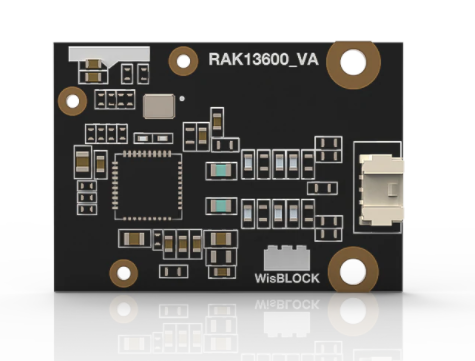
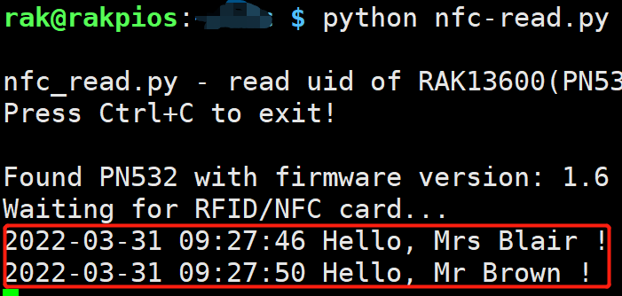
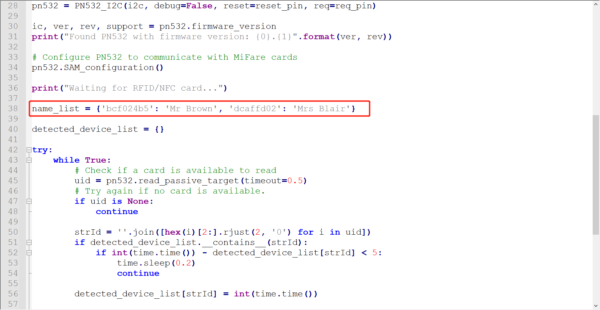

# Read NFCard ID through WisBlock NFC Reader RAK13600 and RAK7391

[TOC]

## 1. Introduction

This guide explains how to test the [WisBlock NFC Reader RAK13600](https://store.rakwireless.com/products/rak13600-wisblock-nfc-reader?_pos=1&_sid=dcf6710e6&_ss=r) with RAK7391 through I2C interface using Python. 


## 2. Hardware

### 2.1. RAK13600

WisBlock NFC Reader RAK13600 enables reading and writing of NFC tags (RFID cards, NFC enabled devices like phones). It is an WisBlock IO module with an external NFC antenna to connect with the NFC devices.



 It needs to connect with NFC antenna as follows:

   


### 2.2. Connection diagram

Firstly, connect RAK13600  to RAK7391 board.


## 3. Software

The example code can be found in the [**rak13600-nfc-read.py**](https://git.rak-internal.net/product-rd/gateway/wis-developer/rak7391/wisblock-python/-/tree/dev/interface/rak13600) file. In order to run this， you will first have to install some required modules. 

The recommended way to do this is to use [virtualenv](https://virtualenv.pypa.io/en/latest/) to create an isolated environment. To install `virtualenv` you just have to:

```
sudo apt install virtualenv
```

Once installed you can create the environment and install the dependencies (run this on the `rak13600` folder):

```
virtualenv .env
source .env/bin/activate
pip install -r requirements.txt
```

Once installed you can run the example by typing:

```
python rak13600-nfc-read.py
```

When a NFCard was placed on the antenna, the logs will be shown as follows.



Because I create dictionary  in python code, so when NFCard ID detected,  the owner's name of card will be display.

You can modified the dictionary to create a relationship between your card and name as follows.




After running example， you can leave the virtual environment by typing `deactivate`. To activate the virtual environment again you just have to `source .env/bin/activate` and run the script. No need to install the dependencies again since they will be already installed in the virtual environment.


## 4. License

Thank adafruit for [adafruit-circuitpython-pn532 library](https://pypi.org/project/adafruit-circuitpython-pn532/). We also share the example under MIT license.
