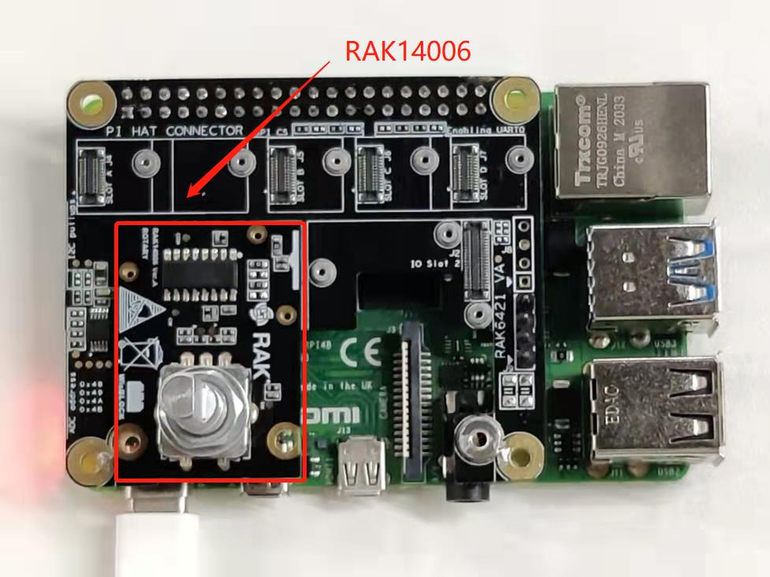
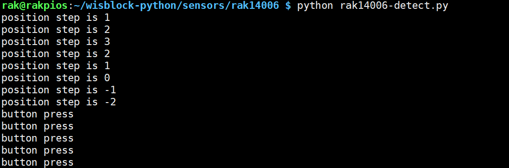

# Detecting position and button press using WisBlock Rotary Encoder RAK14006

[TOC]

## 1. Introduction

This guide explains how to use the [WisBlock Rotary Encoder RAK14006](https://docs.rakwireless.com/Product-Categories/WisBlock/RAK14006/Overview/) in combination with RAK6421 Pi Hat to detect position change and button press using Python. 

### 1.1 RAK14006

The RAK14006 is a rotary encoder module with PEC11L-4125F-S0020 from BOURNS. RAK14006 can detect user inputs such as rotation direction and rotation number of steps. Also, an independent push switch is provided for the user. For more details, you can refer to [RAK14006 datasheet](https://docs.rakwireless.com/Product-Categories/WisBlock/RAK14006/Datasheet).

## 2. Hardware

### 2.1. Hardware required

There are two hardware options to use RAK14006:

- Raspberry Pi + RAK6421 Pi Hat + WisBlock Sensor RAK14006
- RAK7391 WisGate Developer Connect + RAK6421 Pi Hat + WisBlock Sensor RAK14006

The RAK14006 should be connected to the `IO Slot 1` or `IO Slot 2` on the RAK6421 Pi Hat, And RAK6421 Pi Hat can be mounted to Raspberry Pi or RAK7391 board with the 40-pin headers.

### 2.2. Connection diagram



## 3. Software

The example code can be found in the [rak14006-detect.py](rak14006-detect.py) file. In order to run this， you will first have to install some required modules. The recommended way to do this is to use [virtualenv](https://virtualenv.pypa.io/en/latest/) to create an isolated environment. To install `virtualenv` you just have to:

```
sudo apt install virtualenv
```

Once installed you can create the environment and install the dependencies (run this on the `rak14006` folder):

```
virtualenv .env
source .env/bin/activate
pip install -r requirements.txt
```

Once installed you can run the example by typing:

```
python rak14006-detect.py
```

Once the example runs,  you may rotate or press the knob switch of RAK14006, then you can get the  rotary encoder reading below:



After that， you can leave the virtual environment by typing `deactivate`. To activate the virtual environment again you just have to `source .env/bin/activate` and run the script. No need to install the dependencies again since they will be already installed in the virtual environment.
