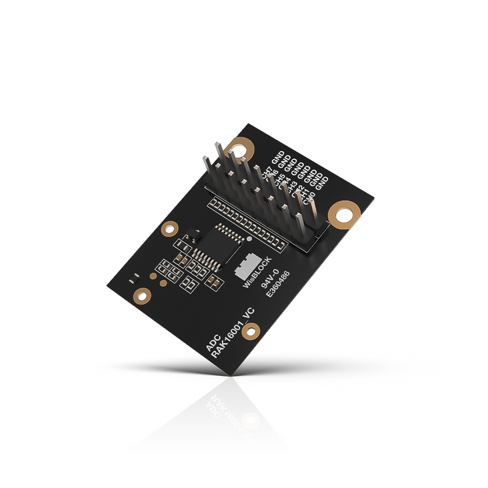
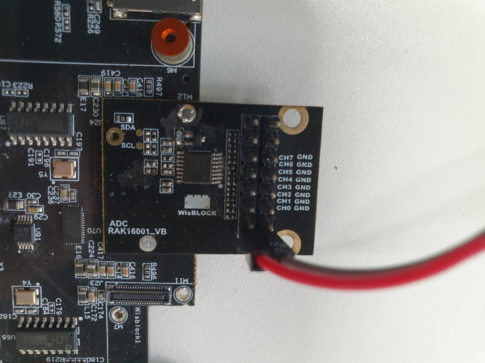

# Analog-to-Digital(ADC) conversion using WisBlock IO RAK16001

[TOC]

## 1.Introduction

This guide explains how to use the [WisBlock IO RAK16001](https://docs.rakwireless.com/Product-Categories/WisBlock/RAK16001/Overview/) in combination with RAK6421 Wisblock Hat or RAK7391 WisGate Developer Connect to interface an Analog-to-Digital (ADC) module device through I2C interface using Python. 

### 1.1 ADS7830

The **RAK16001** is an Analog-to-Digital (ADC) module, which uses an **ADS7830** from Texas Instruments that can measure 8-independent voltages or 4-independent differential voltages. The **ADS7830** is an 8-bit ADC module that features a serial I2C interface and an 8-channel multiplexer with one sample-and-hold amplifier circuit. For more information about **ADS7830**, refer to the [Datasheet](https://www.ti.com/lit/ds/symlink/ads7830.pdf?ts=1645412319899&ref_url=https%253A%252F%252Fwww.google.com%252F).

### 1.2. I2C protocol

**I2C** (**Inter-Integrated Circuit**) is a synchronous, multi-controller/multi-target (controller/target), packet switched, single-ended, serial communication bus invented in 1982 by Philips Semiconductors. It is widely used for attaching lower-speed peripheral ICs to processors and microcontrollers in short-distance, intra-board communication. The **ADS7830** supports the I2C serial bus and data transmission protocol, and it operates as a slave device on the I2C bus.  

## 2.Hardware

### 2.1. IO hardware

In this example we will only need to connect RAK16001 to the high-density connector located on RAK6421 Wisblock Hat or RAK7391 WisGate Developer Connect. For more information about **RAK16001**, refer to the [Datasheet](https://docs.rakwireless.com/Product-Categories/WisBlock/RAK16001/Datasheet/).

- RAK16001 WisBlock ADC Module



### 2.2. Other hardware

You will need a couple of cables to connect RAK16001 modules to your analog voltage input. 

### 2.3. Connection diagram

In the following figure, we show you how to measure the analog input on channel 0. To measure other channels, just connect the wires to corresponding channels.



## 3. Software

### 3.1. Address Byte and Command Byte

The example code we provided lists the possible values for the **ADS7830**'s address byte and command byte. The address byte defines the address of ADS7830's I2C address. Device address various basic on how you connect pin A0 and A1 to VDD or digital ground. **RAK16001** by default set both pin A0 and A1 to 0, thus the address byte is 1001000, which is 0x48 in hexadecimal. The command byte determines the operating mode of **ADS7830**, which is shown in the table below:

| MSB  | 6    | 5    | 4    | 3    | 2    | 1    | lsb  |
| ---- | ---- | ---- | ---- | ---- | ---- | ---- | ---- |
| SD   | C2   | C1   | C0   | PD1  | PD0  | X    | X    |

SD: Single-Ended/Differential Input, 0 means Differential Input, 1 means Single-Ended Inputs.

C2-C0: Channel Selections

PD1: Power-Down. 0 means Power-Down Selection, X means unused.

For details about how Channel Selections bits and Power-Down bits are set, please check table 1 and table 2 in **ADS7830**'s '[datasheet](https://www.ti.com/lit/ds/symlink/ads7830.pdf?ts=1645412319899&ref_url=https%253A%252F%252Fwww.google.com%252F). 

In the example code, we set the ADS7830 to Single-Ended mode. PD1 is set to 0 and PD0 is set to 1, which means the internal reference is OFF and A/D converter is ON. Since we are only using channel 1, we set C2-C0 to 000. 

The code for the WisBlock sensor is split into methods:

* **setup**: Arduino setup code, initializes all the required hardware (debug serial, modbus, SHTC3 and LED)
* **loop**: Arduino loop, runs forever
* **modbus_setup**: enables RAK5802, starts serial communication and sets up coil (LED) and registries
* **modbus_loop**: checks for incomming packets and updates coil (LED)
* **shtc3_setup**: sensor initialization
* **shtc3_read**: reads the sensor and populates registries
* **led_setup**: LED initialization
* **led_set**: sets the LED on or off

### 3.2. Example Code

The example code can be found in the [rak16001_read.py](rak16001_read.py) file. In order to run this you will first have to install some required modules. The recommended way to do this is to use [virtualenv](https://virtualenv.pypa.io/en/latest/) to create a isolated environment. To install `virtualenv` you just have to:

```
sudo apt install virtualenv
```

Once installed you can create the environment and install the dependencies (run this on the `rak16001` folder):

```
virtualenv .env
source .env/bin/activate
pip install -r requirements.txt
```

Once installed you can run the example by typing:

```
python rak16001_read.py
```

After that you can leave the virtual environment by typing `deactivate`. To activate the virtual environment again you just have to `source .env/bin/activate` and run the script. No need to install the dependencies again since they will be already installed in the virtual environment.
