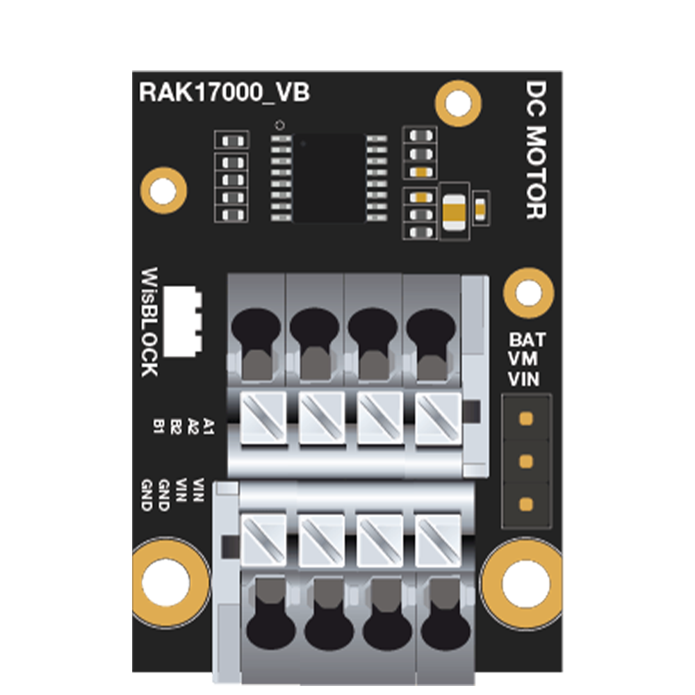

# Drive one stepper motor or two DC motors using WisBlock Motor Control Module RAK17000

[TOC]

## 1.Introduction

This guide explains how to use the [WisBlock Motor Control Module RAK17000](https://store.rakwireless.com/products/motor-control-module-rak17000) in combination with RAK6421 WisBlock Hat or RAK7391 WisGate Developer Connect to Drive one stepper motor or two DC motors using Python.

### 1.1. RAK17000

The RAK17000 is a DC motor driver module, it can drive one stepper motor or two DC motors. The RAK17000 module uses the DRV8833 motor driver IC from Texas Instruments. For more information about RAK17000, refer to the [RAK17000 datasheet](https://docs.rakwireless.com/Product-Categories/WisBlock/RAK17000/Datasheet/#overview).



## 2.Hardware

### 2.1. Hardware required 

There are multiple hardware options to mount RAK17000:

- Raspberry Pi + RAK6421 WisBlock Hat + RAK17000
- RAK7391 WisGate Developer Connect +  RAK6421 WisBlock Hat + RAK17000
- RAK7391 WisGate Developer Connect + RAK17000

The RAK17000 can be connected to the IO slot on the RAK6421 Pi Hat, and RAK6421 Pi Hat can be mounted to Raspberry Pi or RAK7391 through GPIO 40-pin headers,  you can also mount RAK13004 to WisBlock Connector on the RAK7391 directly. You also need two DC motors or one stepper motor.

### 2.2. Connection diagram

You need to set a header jumper and short VM and BAT to enable power from the battery of the RAK7391. You can connect up to two DC motors by using channels A and B. To use channel A, connect the DC motor on A1 and A2. To use channel B, connect the DC motor on B1 and B2. You need to use both channels if you are driving a stepper motor.


## 3. Software

The example code can be found in the `rak17000` folder. In order to run this you will first have to install some required modules. The recommended way to do this is to use [virtualenv](https://virtualenv.pypa.io/en/latest/) to create a isolated environment. To install `virtualenv` you just have to:

```
sudo apt install virtualenv
```

Once installed you can create the environment and install the dependencies (run this on the `rak17000` folder):

```
virtualenv .env
source .env/bin/activate
pip install -r requirements.txt
```

Once installed you can run the DC motor example by typing:

```
python rak17000_dc_motor.py
```

If you connect a stepper motor, run the example by typing:

```
python rak17000_stepper_motor.py
```

After that you can leave the virtual environment by typing `deactivate`. To activate the virtual environment again you just have to `source .env/bin/activate` and run the script. No need to install the dependencies again since they will be already installed in the virtual environment.