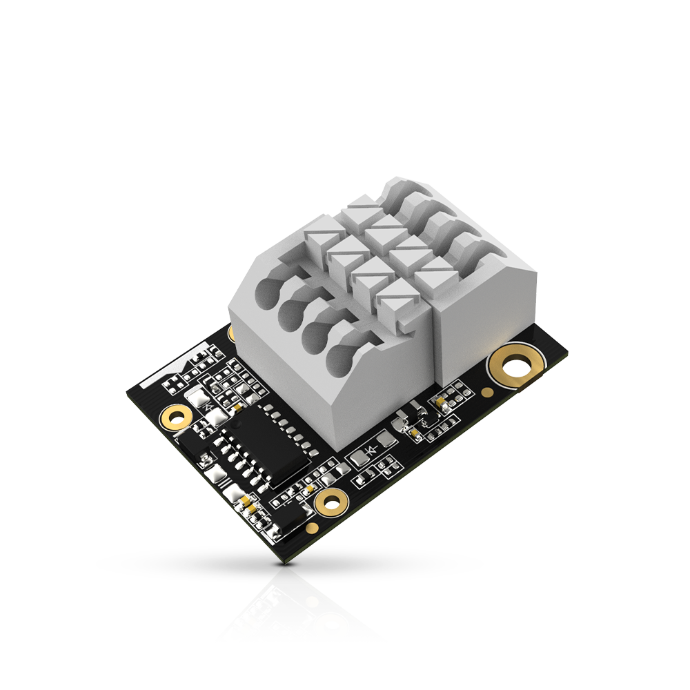
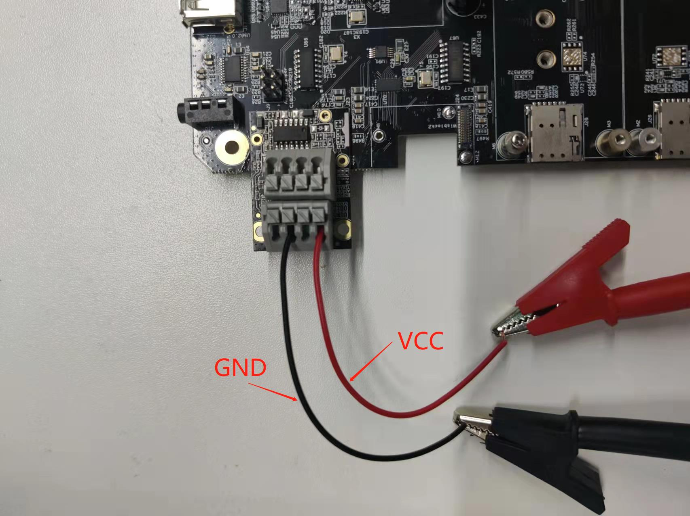

# Reading 4-20 mA current input using WisBlock IO RAK5801

[TOC]

## 1.Introduction

This guide explains how to use the [WisBlock IO RAK5801](https://store.rakwireless.com/products/rak5801-4-20ma-interface) in combination with RAK6421 WisBlock Hat or RAK7391 WisGate Developer Connect to reading 4-20 mA current using Python.

### 1.1. RAK5801

The RAK5801 is a 4-20 mA current loop extension module that allows you to make an IoT solution for analog sensors with 4-20 mA interface. This module converts the 4-20 mA current signal into voltage range supported by the **ADS1115**  for further digitalization and data transmission.  For more information about RAK5801, refer to the [RAK5801 datasheet](https://docs.rakwireless.com/Product-Categories/WisBlock/RAK5801/Datasheet/).



### 1.2. ADS1115

ADS1115 is a high recision16-bit ADC with 4 channels. it have a programmable gain from 2/3x to 16x so you can amplify small signals and read them with higher precision. Refer to datasheet for more information : [ADS1115 datasheet](https://cdn-shop.adafruit.com/datasheets/ads1115.pdf).

## 2.Hardware

### 2.1. Hardware required 

There are two hardware options to use RAK5801:

- Raspberry Pi + RAK6421 WisBlock Hat + WisBlock IO RAK5801
- RAK7391 WisGate Developer Connect + WisBlock IO RAK5801

The RAK5801 can be connected to the IO slot on the RAK6421 Pi Hat, and RAK6421 Pi Hat can be mounted to Raspberry Pi,  you also can mounted RAK5801 to WisBlock Connector on the RAK7391 directly.

### 2.2. Connection diagram

There are two  analog input ports (`AIN0` and `AIN1`) on the RAK5801, but only `AIN1` is available now.  You can use it as long as your sensors operate at 3.3 V or 12 V with 4-20 mA operating current.



## 3. Software

The example code can be found in the [rak5801_read.py](rak5801_read.py) file. In order to run this you will first have to install some required modules. The recommended way to do this is to use [virtualenv](https://virtualenv.pypa.io/en/latest/) to create a isolated environment. To install `virtualenv` you just have to:

```
sudo apt install virtualenv
```

Once installed you can create the environment and install the dependencies (run this on the `rak5801` folder):

```
virtualenv .env
source .env/bin/activate
pip install -r requirements.txt
```

Once installed you can run the example by typing:

```
python rak5801_read.py
```

After that you can leave the virtual environment by typing `deactivate`. To activate the virtual environment again you just have to `source .env/bin/activate` and run the script. No need to install the dependencies again since they will be already installed in the virtual environment.
