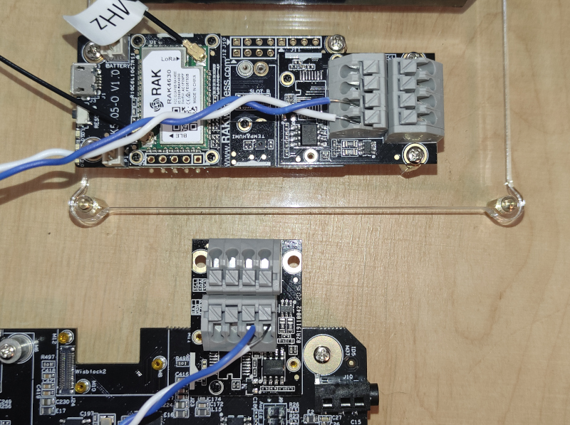

# Modbus RTU communication using WisBlock IO RAK5802

[TOC]

## 1.Introduction

This guide explains how to use the [WisBlock IO RAK5802](https://store.rakwireless.com/collections/wisblock-interface/products/rak5802-rs485-interface) in combination with RAK6421 Wisblock Hat or RAK7391 WisGate Developer Connect to interface a Modbus device using Python.

### 1.1 RS485 standard

**RS-485**, also known as **TIA-485(-A)** or **EIA-485**, is a standard defining the electrical characteristics of drivers and receivers for use in serial communications systems. Electrical signaling is balanced, and multipoint systems are supported. The standard is jointly published by the [Telecommunications Industry Association](https://en.wikipedia.org/wiki/Telecommunications_Industry_Association) and [Electronic Industries Alliance](https://en.wikipedia.org/wiki/Electronic_Industries_Alliance) (TIA/EIA). Digital communications networks implementing the standard can be used effectively over long distances and in electrically noisy environments. Multiple receivers may be connected to such a network in a linear, multidrop bus. These characteristics make RS-485 useful in industrial control systems and similar applications.

### 1.2. Modbus protocol

[Modbus](https://en.wikipedia.org/wiki/Modbus) is an industrial protocol published for the first time in 1979 but still widely used in industrial sensors and appliances. The RAK5802 IO Module allows you to interface sensors using Modbus over RS485 serial lines (a.k.a Modbus RTU).

## 2.Hardware

### 2.1. Sensor hardware

In this example we will first create a Modbus sensor (a.k.a. master or sender) using a WisBlock Starting Kit with a RAK1902 Temperature and Humidity Sensor and a RAK5802 IO Module.

- WisBlock Starter Kit (WisBlock Base RAK5005-O + WisBlock Core RAK4631)


- WisBlock IO RAK5802


- WisBlock Sensor RAK1901


### 2.2. Client hardware

On the client side (a.k.a. receiver) we have two options:

- Raspberry Pi + RAK6421 WisBlock Hat + WisBlock IO RAK5802
- RAK7391 WisGate Developer Connect + WisBlock IO RAK5802

### 2.3. Other hardware

You will need a couple of cables to connect both RAK5802 modules (on the client and on the sensor) and the required cabling to flash and power the WisBlock and the client board.

### 2.4. Connection diagram



## 3. Software

### 3.1. Sensor software

The sensor code can be found under the [rak5802_modbus_device](rak5802_modbus_device/rak5802_modbus_device.ino) folder. You can open it directly with the Arduino IDE but you will first have to have it installed as well as the RAK6430 BSP. Check the [RAK4631 Quick Start Guide](https://docs.rakwireless.com/Product-Categories/WisBlock/RAK4631/Quickstart) to know more.

- [ArduinoIDE](https://www.arduino.cc/en/Main/Software)
- [RAK4630 BSP](https://github.com/RAKWireless/RAK-nRF52-Arduino)

At the top of the example sketch you have links to install the required libraries using the Arduino IDE Library Manager.

- [Arduino RS485 library](https://www.arduino.cc/en/Reference/ArduinoRS485)
- [ArduinoModbus library](https://www.arduino.cc/en/ArduinoModbus/ArduinoModbus)
- [Sparkfun SHTC3 Humidity and Temperature Sensor Library](https://github.com/sparkfun/SparkFun_SHTC3_Arduino_Library)

The code for the WisBlock sensor is split into methods:

* **setup**: Arduino setup code, initializes all the required hardware (debug serial, modbus, SHTC3 and LED)
* **loop**: Arduino loop, runs forever
* **modbus_setup**: enables RAK5802, starts serial communication and sets up coil (LED) and registries
* **modbus_loop**: checks for incomming packets and updates coil (LED)
* **shtc3_setup**: sensor initialization
* **shtc3_read**: reads the sensor and populates registries
* **led_setup**: LED initialization
* **led_set**: sets the LED on or off

### 3.2. Client software

The client code can be found in the [rak5802_modbus_client.py](rak5802_modbus_client.py) file. In order to run this you will first have to install some required modules. The recommended way to do this is to use [virtualenv](https://virtualenv.pypa.io/en/latest/) to create a isolated environment. To install `virtualenv` you just have to:

```
sudo apt install virtualenv
```

Once installed you can create the environment and install the dependencies (run this on the `rak5802_modbus` folder):

```
virtualenv .env
source .env/bin/activate
pip install -r requirements.txt
```

Once installed you can run the example by typing:

```
python rak5802_modbus_client.py
```

After that you can leave the virtual environment by typing `deactivate`. To activate the virtual environment again you just have to `source .env/bin/activate` and run the script. No need to install the dependencies again since they will be already installed in the virtual environment.