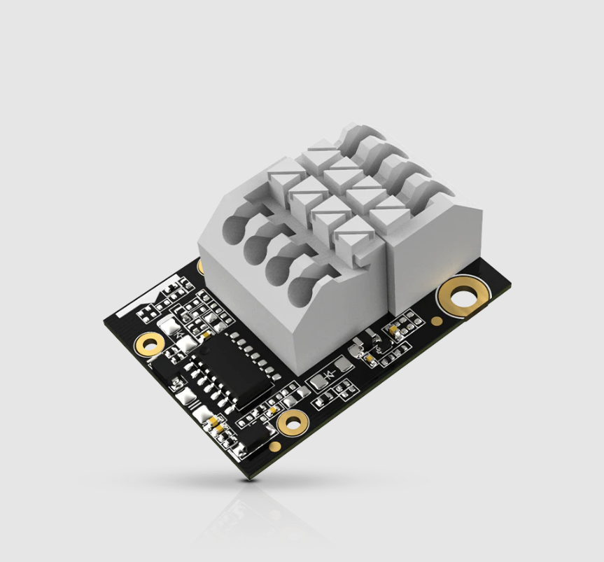

# Reading 0-5V analog voltage input using WisBlock IO RAK5811

[TOC]

## 1.Introduction

This guide explains how to use the [WisBlock IO RAK5811](https://store.rakwireless.com/products/rak5811-0-5v-analog-interface) in combination with RAK6421 WisBlock Hat or RAK7391 WisGate Developer Connect to reading 0-5v analog voltage input using Python.

### 1.1. RAK5811

The RAK5811 is a 0-5 V analog input interface module. The signal is routed through the IO bus to the **ADS1115** for further digitalization and data transmission.   For more information about RAK5811, refer to the [RAK5811 datasheet](https://docs.rakwireless.com/Product-Categories/WisBlock/RAK5811/Datasheet/#overview).



### 1.2. ADS1115

ADS1115 is a high recision16-bit ADC with 4 channels. it have a programmable gain from 2/3x to 16x so you can amplify small signals and read them with higher precision. Refer to datasheet for more information : [ADS1115 datasheet](https://cdn-shop.adafruit.com/datasheets/ads1115.pdf).

## 2.Hardware

### 2.1. Hardware required 

There are two hardware options to use RAK5811:

- Raspberry Pi + RAK6421 WisBlock Hat + WisBlock IO RAK5811
- RAK7391 WisGate Developer Connect + WisBlock IO RAK5811

The RAK5811 can be connected to the IO slot on the RAK6421 Pi Hat, and RAK6421 Pi Hat can be mounted to Raspberry Pi,  you also can mounted RAK5811 to WisBlock Connector on the RAK7391 directly.

### 2.2. Connection diagram

There are two  analog input ports (`AIN0` and `AIN1`) on the RAK5811, you can use them as long as your sensors operate at 5 v.


## 3. Software

The example code can be found in the [rak5811_read.py](rak5811_read.py) file. In order to run this you will first have to install some required modules. The recommended way to do this is to use [virtualenv](https://virtualenv.pypa.io/en/latest/) to create a isolated environment. To install `virtualenv` you just have to:

```
sudo apt install virtualenv
```

Once installed you can create the environment and install the dependencies (run this on the `rak5801` folder):

```
virtualenv .env
source .env/bin/activate
pip install -r requirements.txt
```

Once installed you can run the example by typing:

```
python rak5811_read.py
```

After that you can leave the virtual environment by typing `deactivate`. To activate the virtual environment again you just have to `source .env/bin/activate` and run the script. No need to install the dependencies again since they will be already installed in the virtual environment.
