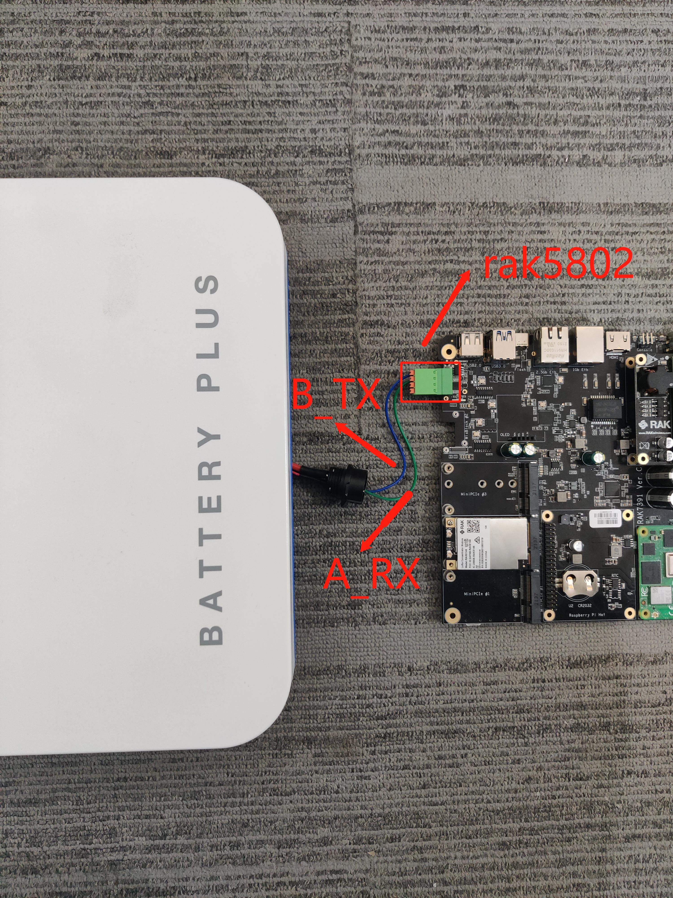

# Read Battery Plus status with RAK5802

[TOC]

## 1.Introduction

[RAK9155 Battery Plus](https://docs.rakwireless.com/Product-Categories/Accessories/RAK9155/Quickstart/#overview) is the RAK's latest battery system incorporating a solar charging system, It features a 640Wh battery capable of providing 120W continuous supply at 12V, it also offers a RS485 bus to monitor the battery, this guide explains how to use the [RAK5802 RS485](https://store.rakwireless.com/collections/wisblock-interface/products/rak5802-rs485-interface) in combination with [WisGate Connect](https://docs.rakwireless.com/Product-Categories/WisGate/RAK7391/Overview/#product-description) to monitor the battery using Python.


## 2.Hardware

### 2.1.Hardware requirements

In this example we need a RAK5802 or RAK5802M and a RAK9155 Battery Plus, you will need two cables to connect them.

So here is the hardware requirements list:

- 1x RAK5802/RAK5802M

- 1x RAK9155 Battery Plus

- 1x RAK7391 Wisgate Connect

- Two cables

### 2.2. Connection diagram

In this example we are using a RAK5802M as the master, mounted to the Wisblock #1 on the RAK7391 Wisgate Connect. The A_RX pin and B_TX pin on master should be connected to the corresponding pins on the Battery Plus.



## 3. Software

The example code can be found in the [rak9155_read.py](rak9155_read.py) file. In order to run this you will first have to install some required modules. The recommended way to do this is to use [virtualenv](https://virtualenv.pypa.io/en/latest/) to create a isolated environment. To install `virtualenv` you just have to:

```
sudo apt install virtualenv
```

Once installed you can create the environment and install the dependencies (run this on the `rak9155` folder):

```
virtualenv .env
source .env/bin/activate
pip install -r requirements.txt
```

Once installed you can run the example by typing:

```
python rak9155_read.py
```

After that you can leave the virtual environment by typing `deactivate`. To activate the virtual environment again you just have to `source .env/bin/activate` and run the script. No need to install the dependencies again since they will be already installed in the virtual environment.
