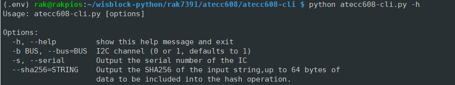
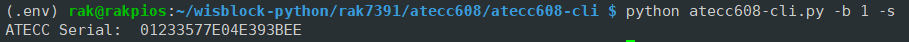
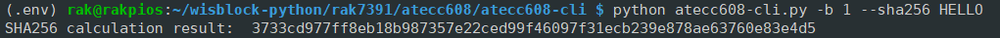

# Get Start wih the ATECC608A on RAK7391 Using Python

[TOC]

## 1. Introduction

This guide explains how to read the ATECC608A's serial number and perform a SHA-256 hash operation. 

### 1.1 ATECC608A

The [ATECC608A](https://www.microchip.com/en-us/product/atecc608a) is a secure element from the Microchip CryptoAuthentication portfolio with advanced Elliptic Curve Cryptography (ECC) capabilities. The ATECC608A also offer an integrated AES hardware accelerator strengthening hardware based security.  

### 1.2. I2C protocol

[**I2C**](https://en.wikipedia.org/wiki/I²C) (Inter-Integrated Circuit), alternatively known as I2C or IIC, it is widely used for attaching lower-speed peripheral ICs to processors and microcontrollers in short-distance, intra-board communication. To manage a I2C device, you need to know the device's I2C bus number and device address first. The device address of ATECC608A is configured to **0x60** on RAK7391, and it is connected to i2c bus 1. For more information about ATECC608A, please check the [datasheet](https://ww1.microchip.com/downloads/en/DeviceDoc/ATECC608A-CryptoAuthentication-Device-Summary-Data-Sheet-DS40001977B.pdf).

## 2. Hardware

The security element ATECC608A is soldered on RAK7391, thus users don't need to do anything. 

## 3. Example Code

The example code can be found in the atecc608-cli.py file. In order to run this you will first have to install some required modules. The recommended way to do this is to use [virtualenv](https://virtualenv.pypa.io/en/latest/) to create a isolated environment. To install `virtualenv` you just have to:

```plaintext
sudo apt install virtualenv
```

Once installed you can create the environment and install the dependencies (run this on the `rak16001` folder):

```plaintext
virtualenv .env
source .env/bin/activate
pip install -r requirements.txt
```

The example script provided is packed as a command line interface for users to interact with ATECC608A. Here are some command lines for users to get start with:

- check the help information

  ```
  python atecc608-cli.py -h
  ```

  The expected output should be like:

  

- get the unique ATECC Serial number of the security element:

  ```
  python atecc608-cli.py -b 1 -s
  ```

  The expected output should be like (the serial number is unique for each and every ATECC608A chip):

  

- perform a SHA-256 hash operation to the string HELLO:

  ```
  python atecc608-cli.py -b 1 --sha256 HELLO
  ```

  The expected output should be something like :

  

After that you can leave the virtual environment by typing `deactivate`. To activate the virtual environment again you just have to `source .env/bin/activate` and run the script. No need to install the dependencies again since they will be already installed in the virtual environment.
