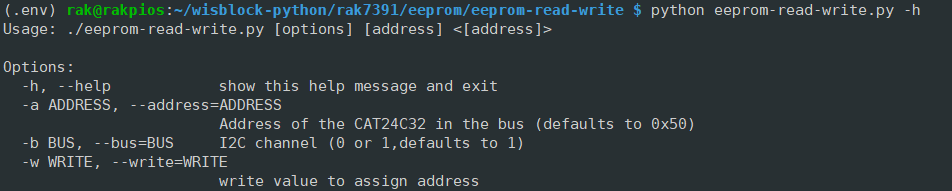
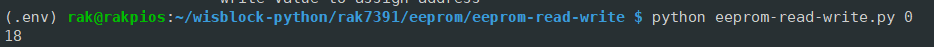
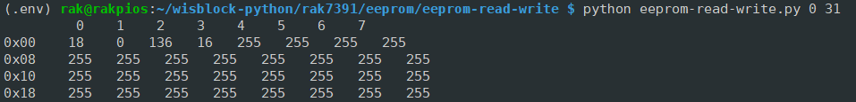
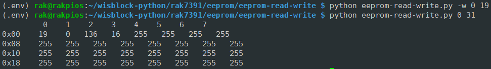

# RAK7391 Onboard EEPROM Read and Write Using Python

[TOC]

## 1. Introduction

This guide explains how to read from the RAK7391 onboard EEPROM, as well as write to it. 

### 1.1 EEPROM

[**EEPROM**](https://en.wikipedia.org/wiki/EEPROM) stands for electrically erasable programmable read-only memory and is a type of non-volatile memory used in computers, integrated in microcontrollers for smart cards and remote keyless systems, and other electronic devices to store relatively small amounts of data by allowing individual bytes to be erased and reprogrammed.

The EEPROM chip used on RAK7391 is **CAT24C32**. It is a EEPROM Serial 32-Kb i2c device, internally organized as 4096 words of 8 bits each. Pin A0, A1, and A2 are used to define device address, these three pins are hard-wired HIGH or LOW allowing for up to eight devices to be used(cascaded) on the same bus.  For more information about CAT24C32, please check the [datasheet](https://www.onsemi.com/pdf/datasheet/cat24c32-d.pdf).

### 1.2. I2C protocol

[**I2C**](https://en.wikipedia.org/wiki/I²C) (Inter-Integrated Circuit), alternatively known as I2C or IIC, it is widely used for attaching lower-speed peripheral ICs to processors and microcontrollers in short-distance, intra-board communication. To manage a I2C device, you need to know the device's I2C bus number and device address first. The device address of CAT24C32 is configured to **0x50** on RAK7391, and it is connected to i2c bus 1.

## 2. Hardware

The EEPROM chip CAT24C32 is soldered on RAK7391, thus users don't need to do anything. 

## 3. Example Code

The example code can be found in the eeprom-read-write.py file. In order to run this you will first have to install some required modules. The recommended way to do this is to use [virtualenv](https://virtualenv.pypa.io/en/latest/) to create a isolated environment. To install `virtualenv` you just have to:

```plaintext
sudo apt install virtualenv
```

Once installed you can create the environment and install the dependencies (run this on the `rak16001` folder):

```plaintext
virtualenv .env
source .env/bin/activate
pip install -r requirements.txt
```

Once installed you can run the example by typing:

```plaintext
python eeprom-read-write.py
```

The example script provided is packed as a command line interface for users to interact with the EEPROM. Here are some command lines for users to get start:

- check the help information

  ```
  python eeprom-read-write.py -h
  ```

  The expected output should be like:

  

- read a signed address:

  ```
  python eeprom-read-write.py 0
  ```

  The expected output should be like (the output varies depending on values stored in the EEPROM):

  

- read continuous addresses:

  ```
  python eeprom-read-write.py 0 31
  ```

  The expected output should be something like :

  

- write to EEPROM and then read again:

  ```
  python eeprom-read-write.py -w 0 19
  python eeprom-read-write.py 0 31
  ```

  The expected output should be something like :

  

After that you can leave the virtual environment by typing `deactivate`. To activate the virtual environment again you just have to `source .env/bin/activate` and run the script. No need to install the dependencies again since they will be already installed in the virtual environment.
