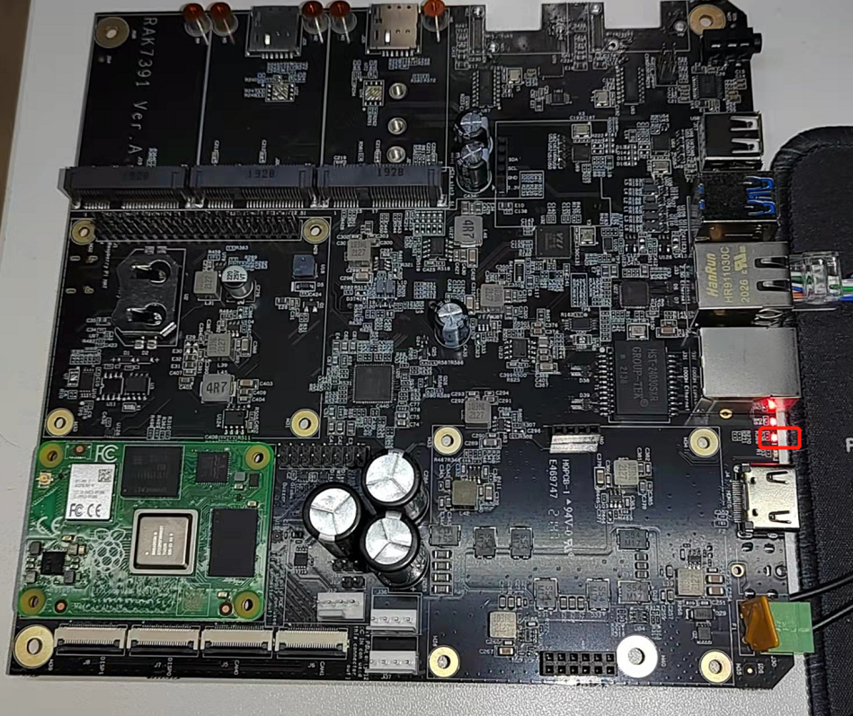

# Control TPT29555 GPIO Expander to blink led in RAK7391

[TOC]

## 1. Introduction

The RAK7391 has two 16 bits [TPT29555](docs/TPT29555.pdf) GPIO expander driven via I2C. 


## 2. Hardware

Since the LED and TPT29555  GPIO Expander used are all in RAK7391 board, we don't need to prepare other hardwares except RAK7391.

Schematic diagram of LED and IO0_7 of TPT29555  in RAK7391 is showed as follows.


RAK7391 comes with two TPT29555 chips soldered on board, and their I2C address are `0x23`and `0x27`.


## 3. Software

The example code can be found in the [led-blink.py](https://git.rak-internal.net/product-rd/gateway/wis-developer/rak7391/wisblock-python/-/tree/dev/rak7391/tpt29555/) file. we also have to install some required python modules. The recommended way to do this is to use [virtualenv](https://virtualenv.pypa.io/en/latest/) to create an isolated environment. To install `virtualenv` you just have to:

```
sudo apt install virtualenv
```

Once installed you can create the environment and install the dependencies (run this in the `rak1903-read` directory):

```
virtualenv .env
source .env/bin/activate
pip install -r requirements.txt
```

Once installed you can run the example by typing:

```
python led-blink.py
```

The led on RAK7391 will blink.



After that you can leave the virtual environment by typing `deactivate`. To activate the virtual environment again you just have to `source .env/bin/activate` and run the script. No need to install the dependencies again since they will be already installed in the virtual environment.

## 4. License

We  share the project under MIT license.


