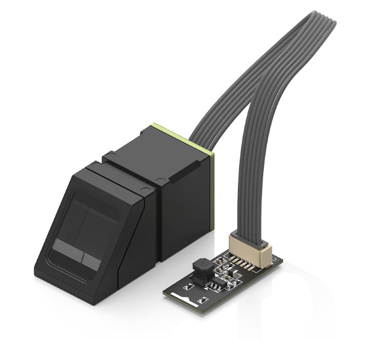
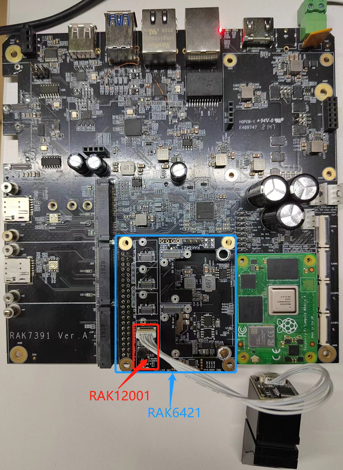
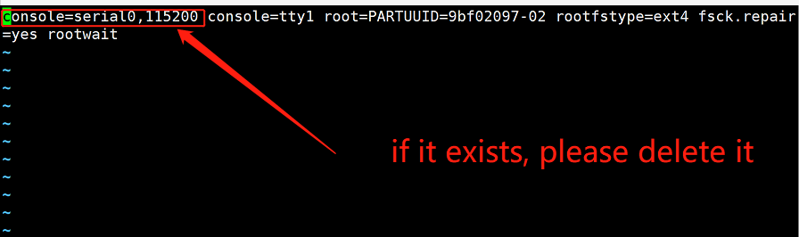
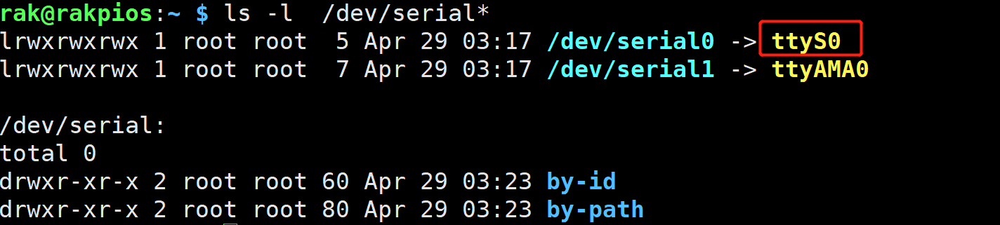

# Enroll and identify fingerprint with WisBlock sensor RAK12001 and Pi-Hat RAK6421 and RAK7391

[TOC]

## 1. Introduction

This guide explains how to use the [WisBlock sensor RAK12001](https://store.rakwireless.com/products/rak12001-fingerprint-module) in combination with RAK6421 Pi-Hat to enroll and identify fingerprint. 

## 2. Hardware

### 2.1. Sensor hardware

The RAK12001 WisBlock Fingerprint Sensor Module. This module supports both fingerprint enrollment and fingerprint matching.  It uses UART port. 



 

### 2.2. RAK6421 Pi-Hat

RAK6421 is a pi-hat  for Raspberry pi 3B/4B or RAK7391 which has 4 sensor slots and 2 IO slots of Wisblock. 

	


### 2.3. Connection diagram

Firstly, connect RAK12001  to RAK6421 board with `slot A`.  And then connect RAK6421 to RAK7391. 

**Note:**   `slot B` and `slot C` which do not connect with serial port, and `slot D` connect with `/dev/ttyAMA0` which often be used for Bluetooth of RPi, so we'd better use `slot A` for RAK12001.

	

We can also connect RAK6421 to Raspberry pi 4B+.

## 3. Software

### 3.1 preparation

We use slot A of RAK6421, so before test we  must add the line bellow to `/boot/config.txt` to enable serial port 0.

```
enable_uart=1
```
If you use raspberryPi OS, you should make sure there is no configuration about serial0 in `/boot/cmdline.tx`.


Then reboot RAK7391.

After reboot,  we can see there is a serial port named `/dev/ttyS0`.



Now Let's use examples to test RAK12001.

### 3.1 Test

The example code can be found under the [rak12001](https://git.rak-internal.net/product-rd/gateway/wis-developer/rak7391/wisblock-python/-/tree/dev/sensors/rak12001) directory. In order to run this you will first have to install some required modules. The recommended way to do this is to use [virtualenv](https://virtualenv.pypa.io/en/latest/) to create an isolated environment. To install `virtualenv` you just have to:

```
sudo apt install virtualenv
```

Once installed you can create the environment and install the dependencies (run this in the `rak1902-read` directory):

```
virtualenv .env
source .env/bin/activate
pip install -r requirements.txt
```

Once installed you can run the examples.

### 3.1.1 Enroll

Run `enrollFingerprint.py` script to enroll your fingerprint.

```
python enrollFingerprint.py
```

Please enroll according to the printing prompt. The log of entire step is as follows. 

Please note that when you enroll your fingerprint you need put your finger on the sensor `twice`.

```
You can Click ctrl+c to exit process
Currently used templates: 9/1000
Waiting for finger...
Please move out your finger from sensor.

Waiting for the same finger again...

Finger enrolled successfully!
New template position #9
Please move out your finger from sensor.

Enroll another finger or click ctrl+c to exit.
```

If your fingerprint has already been enrolled, the log may be as follows.

```
You can Click ctrl+c to exit process
Currently used templates: 9/1000
Waiting for finger...
Template already exists at position #3
Please enroll another finger !
```

If you want to quit the script, just click `Ctrl + C`.

### 3.1.2 Identify

Run `identifyFingerprint.py` script to identify your fingerprint.

If your fingerprint has already been enrolled,  the log is as follows.

```
Waiting for finger...
You can click ctrl+c to exit process.

Finger detected!
Found template at position #3
The accuracy score is: 122

```

If your fingerprint has not been enrolled,  the log is as follows.

```
Finger detected!
No match found!
```

If you want to quit the script, just click `Ctrl + C`.

### 3.1.3 Delete

Run `deleteFingerprint.py` script to delete fingerprint from sensor.

```
python deleteFingerprint.py
```

After run the script, you should input a number you want to delete.

I delete the number 3 fingerprint, the whole log will be as below. After delete one fingerprint, you can continue to delete another.

If you want to quit the script, just click `Ctrl + C`.

```
You can click ctrl+c to exit process.

Currently used templates: 10/1000
Please enter the template position you want to delete: 3         
Template deleted!

Currently used templates: 9/1000
Please enter the template position you want to delete: 
```


After that you can leave the virtual environment by typing `deactivate`. To activate the virtual environment again you just have to `source .env/bin/activate` and run the script. No need to install the dependencies again since they will be already installed in the virtual environment.

## 4. License

We share the project under MIT license.
