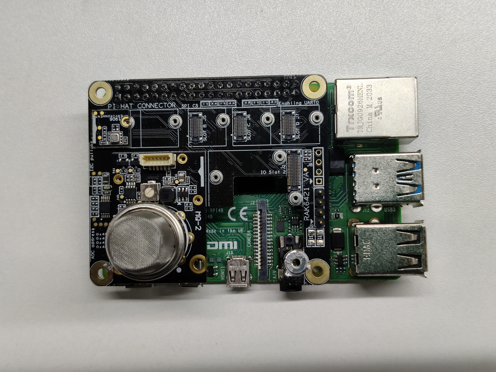

# Measuring  gas concentration using WisBlock sensor RAK12004

[TOC]

## 1. Introduction

This guide explains how to use the [WisBlock Sensor RAK12004](https://docs.rakwireless.com/Product-Categories/WisBlock/RAK12004/Overview/) in combination with RAK6421 Wisblock Hat or RAK7391 WisGate Developer Connect to measure gas concentration using Python. 

### 1.1 RAK12004

The RAK12004 is a gas sensor module, part of the RAKWireless WisBlock Sensor series. The sensor used is the MQ-2 from Zhengzhou Winsen Electronics.

### 1.2. MQ-2

The MQ-2 Gas sensor can detect or measure gasses like LPG, Alcohol, Propane, Hydrogen, CO, and even methane. for more details, you can refer to [MQ-2 datasheet](docs/MQ-2.pdf).

## 2. Hardware

### 2.1. Sensor hardware

There are multiple hardware options to use RAK12004:

- Raspberry Pi + RAK6421 WisBlock Hat + WisBlock Sensor RAK12004

- RAK7391 WisGate Developer Connect + WisBlock Sensor RAK12004
- RAK7391 WisGate Developer Connect + RAK6421 WisBlock Hat + WisBlock Sensor RAK12004

In this example, we will select first option, we use RAK12004 in combination with RAK6421 WisBlock Hat  to detect  smoke concentration. The RAK12015 should be  connected to the `IO Slot 1` or `IO Slot 2` on the RAK6421 WisBlock Hat. 

### 2.2. Connection diagram



## 3. Software

The example code can be found in the [rak12004-reading.py](rak12004-reading.py) file. In order to run this， you will first have to install some required modules. The recommended way to do this is to use [virtualenv](https://virtualenv.pypa.io/en/latest/) to create an isolated environment. To install `virtualenv` you just have to:

```
sudo apt install virtualenv
```

Once installed you can create the environment (run this on the `rak12004-read` folder):

```
virtualenv .env
source .env/bin/activate
```

Install required libraries.

```
pip install -r requirements.txt
```

Once installed you can run the example by typing:

```
python rak12004-reading.py
```

After that， you can leave the virtual environment by typing `deactivate`. To activate the virtual environment again you just have to `source .env/bin/activate` and run the script. No need to install the dependencies again since they will be already installed in the virtual environment.
