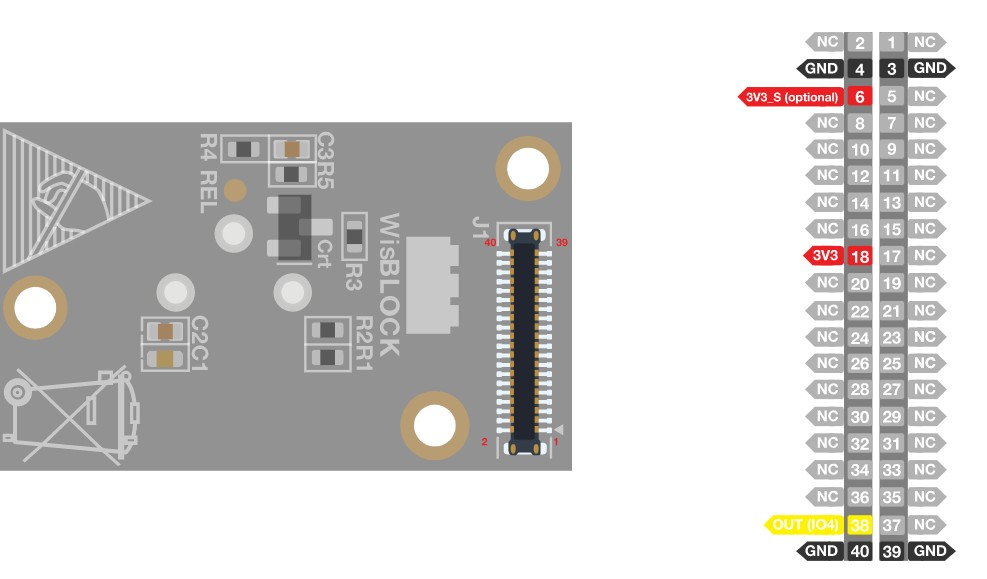
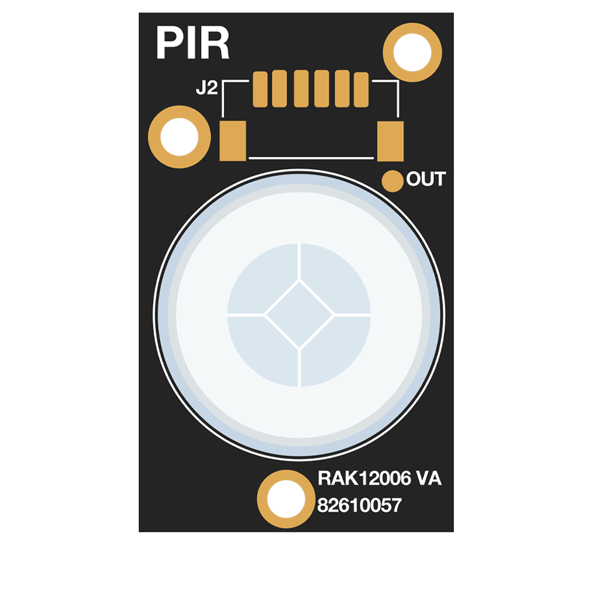
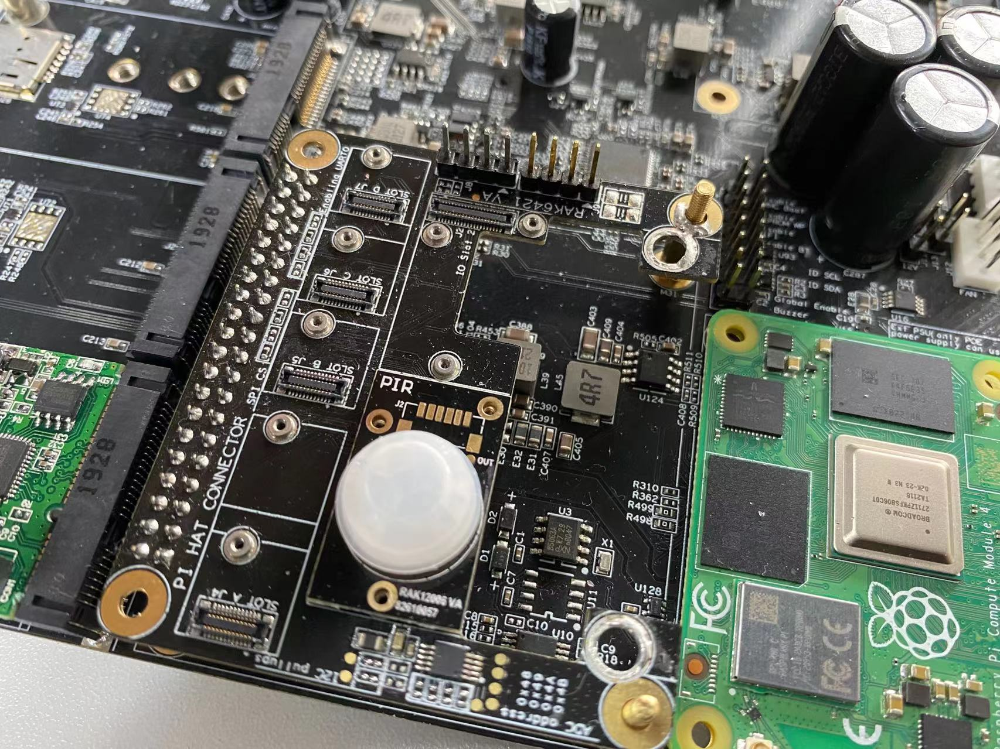

# Monitor the PIR Using Interrupts and Output an Alert with RAK12006 Using Python 

[TOC]

## 1. Introduction

This guide explains how to use the [RAK12006 WisBlock PIR Module](https://docs.rakwireless.com/Product-Categories/WisBlock/RAK12006/Overview/) in combination with RAK6421 Wisblock Hat to monitor the PIR (Pyroelectric Infrared Radial). 

### 1.1. RAK12006

The **RAK12006** is a Pyroelectric Infrared Radial (PIR) module. It is designed to detect occupancy and motion from the infrared radiated objects. The sensor uses [AM312](http://www.image.micros.com.pl/_dane_techniczne_auto/cz%20am312.pdf) from Senba Sensing Technology Co., Ltd. Check [RAK12006's Datasheet](https://docs.rakwireless.com/Product-Categories/WisBlock/RAK12006/Datasheet/) for more details. 

### 1.2. GPIO 

The RAK12006 module has a 40-pin WisConnector that is compatible to the WisBlock Base IO Slot. The pin order of the connector and the pinout definition is shown in the pinout schematic below.




- Only **Digital OUT**, **3V3**, and **GND** are connected to WisConnector.
- An optional **3V3_S** supply voltage can be used to turn ON or OFF the RAK12006 module through the IO2 pin. This can be helpful on low power application.
- To disable the default **3V3** supply and use the alternative **3V3_S** supply source, the resistor jumpers R1 must be 0 Ω and R2 must be NC (not connected).

## 2. Hardware

### 2.1. Hardware Preparation

In this example we need to connect RAK12006 to the high-density connector located on RAK6421 Wisblock Hat. 

- RAK13003 WisBlock IO Expansion Module



The RAK12019 can be mounted on either IO slot of the RAK6421 Wisblock Hat and RAK7391's Wisblock slot. For example, it can be mounted on J1 (slot B) on RAK6421 Wisblock Hat, as shown in the picture below. 




## 3. Software

### 3.1. Basic configuration

If you are using the RAK6421 Wisblock Hat,  you can just mount RAK12006 on the Pi-HAT, and only change the `digital_out_pin` defined in the Python script. If RAK12006 is mounted on Pi-HAT slot 1, the enable pin is 12, which is GPIO 12 (board pin 32); if RAK12006 is mounted on Pi-HAT slot 2, the enable pin is 22, which is GPIO 22 (board pin 15).

### 3.2. Example Code

The example code can be found in the [rak12006-PIR.py](rak12006-PIR.py) file. In order to run this you will first have to install some required modules. The recommended way to do this is to use [virtualenv](https://virtualenv.pypa.io/en/latest/) to create an isolated environment. To install `virtualenv` you just have to:

```
sudo apt install virtualenv
```

Once installed you can create the environment and install the dependencies (run this in the `rak12006-PIR` directory):

```
virtualenv .env
source .env/bin/activate
pip install -r requirements.txt
```

Once installed you can run the example by typing:

```
python rak2006-PIR.py
```

After that you can leave the virtual environment by typing `deactivate`. To activate the virtual environment again you just have to `source .env/bin/activate` and run the script. No need to install the dependencies again since they will be already installed in the virtual environment.

