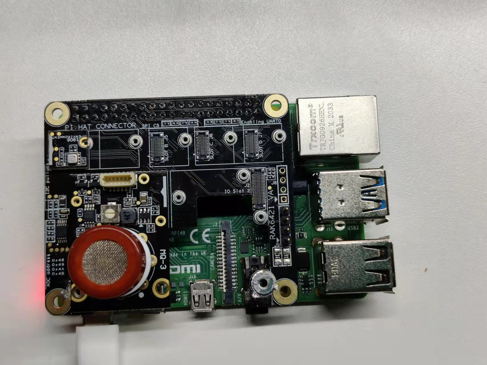

# Measuring  gas concentration using WisBlock sensor RAK12004

[TOC]

## 1. Introduction

This guide explains how to use the [WisBlock Sensor RAK12009](https://docs.rakwireless.com/Product-Categories/WisBlock/RAK12009/Overview/) in combination with RAK6421 Wisblock Hat or RAK7391 WisGate Developer Connect to measure gas concentration using Python. 

### 1.1 RAK12009

The RAK12009 is an Alcohol Gas Sensor module, part of the RAKWireless WisBlock Sensor Series. The sensor used in this module is the MQ-3B from Zhengzhou Winsen Electronics. 

### 1.2. MQ-3B

MQ-3B gas sensor has high sensitivity to alcohol gas and can resistant to the interference of gasoline, smoke and vapour. It is with low cost and suitable for various applications of detecting alcohol at different concentration. for more details, you can refer to [MQ-3 datasheet](docs/MQ-3B.pdf).

## 2. Hardware

### 2.1. Sensor hardware

There are multiple hardware options to use RAK12004:

- Raspberry Pi + RAK6421 WisBlock Hat + WisBlock Sensor RAK12004

- RAK7391 WisGate Developer Connect + WisBlock Sensor RAK12004
- RAK7391 WisGate Developer Connect + RAK6421 WisBlock Hat + WisBlock Sensor RAK12004

In this example, we will select first option, we use RAK12009 in combination with RAK6421 WisBlock Hat  to detect  smoke concentration. The RAK12009 should be  connected to the `IO Slot 1` or `IO Slot 2` on the RAK6421 WisBlock Hat. 

### 2.2. Connection diagram



## 3. Software

The example code can be found in the [rak12009-reading.py](rak12009-reading/rak12009-reading.py) file. In order to run this， you will first have to install some required modules. The recommended way to do this is to use [virtualenv](https://virtualenv.pypa.io/en/latest/) to create an isolated environment. To install `virtualenv` you just have to:

```
sudo apt install virtualenv
```

Once installed you can create the environment (run this on the `rak12009-read` folder):

```
virtualenv .env
source .env/bin/activate
```

Once installed, you also need to install python library `rakmq`,   `rakmq` is developed specially for RAK's MQ-x sensors, you can get source code and install it from our gitlib repository : https://git.rak-internal.net/product-rd/gateway/wis-developer/rak7391/wisblock-python/-/tree/dev/library/rakmq. others required library can be installed by typing:

```
pip install -r requirements.txt
```

Once installed you can run the example by typing:

```
python rak12009-reading.py
```

After that， you can leave the virtual environment by typing `deactivate`. To activate the virtual environment again you just have to `source .env/bin/activate` and run the script. No need to install the dependencies again since they will be already installed in the virtual environment.
