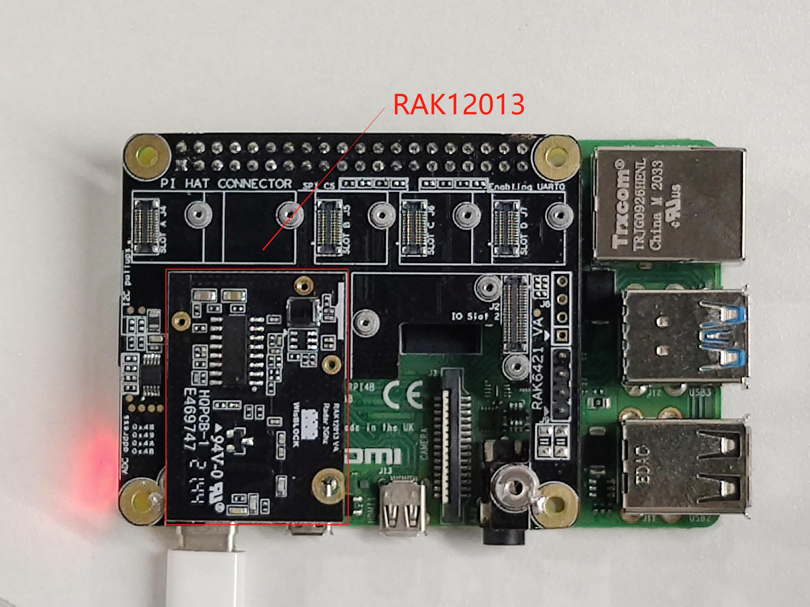

# Detecting motion using WisBlock sensor RAK12013

[TOC]

## 1. Introduction

This guide explains how to use the [WisBlock Sensor RAK12013](https://docs.rakwireless.com/Product-Categories/WisBlock/RAK12013/Overview/) in combination with RAK6421 Pi Hat or RAK7391 WisGate Developer Connect to detect motion using Python. 

### 1.1 RAK12013

RAK12013 is a 3.2GHz microwave radar module based on RCWL-9196. It uses the Doppler radar effect to detect moving objects/motion using microwaves. The RCWL-9196 will transmit and receive a 3GHz radar signal and compare the difference between the two signals to determine whether the object is moving or not. For more details, you can refer to [RAK12013 datasheet](https://docs.rakwireless.com/Product-Categories/WisBlock/RAK12013/Datasheet).

## 2. Hardware

### 2.1. Sensor hardware

There are two hardware options to use RAK12013:

- Raspberry Pi + RAK6421 Pi Hat + WisBlock Sensor RAK12013
- RAK7391 WisGate Developer Connect + RAK6421 Pi Hat + WisBlock Sensor RAK12013

The RAK12013 should be  connected to the `IO Slot 1` or `IO Slot 2` on the RAK6421 Pi Hat, And RAK6421 Pi Hat can be mounted to Raspberry Pi or RAK7391 board with the 40-pin headers.

### 2.2. Connection diagram



## 3. Software

The example code can be found in the [rak12013-rader.py](rak12013-rader.py) file. In order to run this， you will first have to install some required modules. The recommended way to do this is to use [virtualenv](https://virtualenv.pypa.io/en/latest/) to create an isolated environment. To install `virtualenv` you just have to:

```
sudo apt install virtualenv
```

Once installed you can create the environment and install the dependencies (run this on the `rak12013` folder):

```
virtualenv .env
source .env/bin/activate
pip install -r requirements.txt
```

Once installed you can run the example by typing:

```
python rak12013-rader.py
```

After that， you can leave the virtual environment by typing `deactivate`. To activate the virtual environment again you just have to `source .env/bin/activate` and run the script. No need to install the dependencies again since they will be already installed in the virtual environment.
