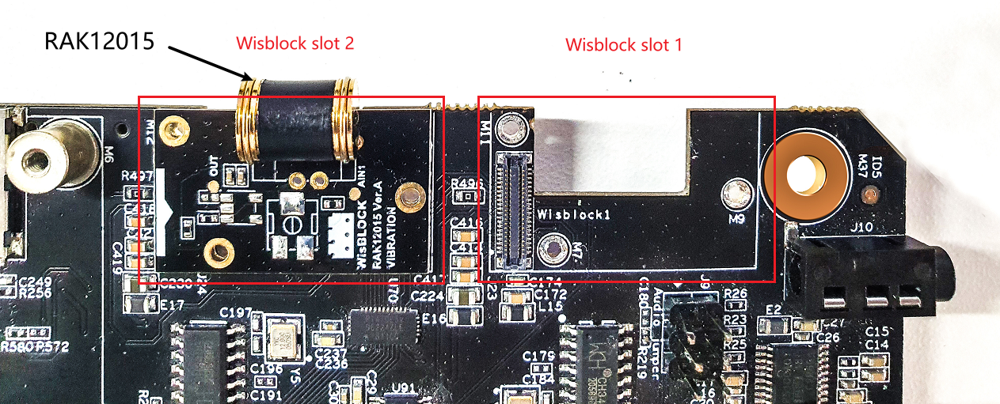

# Detect tampering on the device using WisBlock sensor RAK12015

[TOC]

## 1. Introduction

This guide explains how to use the [WisBlock IO RAK12015](https://docs.rakwireless.com/Product-Categories/WisBlock/RAK12015/Overview/) in combination with RAK6421 Wisblock Hat or RAK7391 WisGate Developer Connect to detect shocks or vibration using Python. 

### 1.1 RAK12015

**[RAK12015](https://docs.rakwireless.com/Product-Categories/WisBlock/RAK12015/Datasheet/#overview)**  is a Vibration Detection Module that uses a high-precision sensor, the [ANT-801S](https://www.tme.eu/Document/f057bde5b9f7ca0c86fbad8e5c5163e5/SENS-801.pdf). This sensor is capable of detecting micro shocks or vibration without direction limits. On RAK7391, the AIN1 pin on RAK12015 is connected to the onboard ADC chip (ADS1115). To detect shock or vibrations, users need to read the ADC to "catch” any changing values.

### 1.2. ADS1115

The RAK7391 has an analog to digital converters named **ADS1115**. ADS1115 is  a high recision16-bit ADC with 4 channels. It has a programmable gain from 2/3x to 16x so you can amplify small signals and read them with higher precision. You might be interested in the datasheet for this chips: [ADS1115 datasheet](https://cdn-shop.adafruit.com/datasheets/ads1115.pdf). For more information about the ADS1115 chip on the RAK7391, please check this [instruction](https://git.rak-internal.net/product-rd/gateway/wis-developer/rak7391/wisblock-python/-/blob/dev/rak7391/ads1115/README.md) for more details.

## 2. Hardware

### 2.1. Sensor hardware

In this example, we use RAK12015 to detect shock and vibration. The RAK12015 should be  connected to the Wisblock slot 1 and slot 2 on the RAK7391. For more information about **RAK12015**, refer to the [Datasheet](https://docs.rakwireless.com/Product-Categories/WisBlock/RAK12015/Datasheet/).

- RAK12015  WisBlock Vibration Detection Module


### 2.2. Connection diagram

In the following figure, we show you how RAK12015 is connected to the RAK7391 board. 



You can connect RAK12015 to either slot 1 or slot 2 on the RAK7391 board. Based on which slot you mount the RAK12015, you need to make changes to the example code, and this will be further explained in the next section.

## 3. Software

### 3.1. Chip configuration

On RAK7391, the AIN1 pin on RAK12015 is connected to the onboard ADC chip (ADS1115), and the i2c address of ADS1115 on the rak7391 is 0x48 and the i2c bus index is 1 by default. ADS1115 uses an I2C communication protocol to read analog values and there is an existing python library [Adafruit ADS1x15 Python library](https://github.com/adafruit/Adafruit_Python_ADS1x15). There are 4 input channels on the ADS1115, the channel number is from 0 to 3. In the example script, it is defined by the following code:

```
ADS1115_CHANNEL = 1
```

If the RAK12015 is connected to the Wisblock slot 1, then the channel number should be set to 1; if RAK12015 is connected to slot 2, then the channel number should be changed to 3.  This example code reads the status of the ADC in a fixed amount of time (can be defined in the  `DELAY_SEC` variable). If the readings remain at 0, it means there is no vibration; however, if the readings changed, it means vibrations are detected.  

### 3.2. Example Code

The example code can be found in the [**rak12015-tampering-detector.py**](****rak12015-tampering-detector.py****) file. In order to run this， you will first have to install some required modules. The recommended way to do this is to use [virtualenv](https://virtualenv.pypa.io/en/latest/) to create an isolated environment. To install `virtualenv` you just have to:

```
sudo apt install virtualenv
```

Once installed you can create the environment and install the dependencies (run this on the `rak12015` folder):

```
virtualenv .env
source .env/bin/activate
pip install -r requirements.txt
```

Once installed you can run the example by typing:

```
python rak12015-tampering-detector.py
```

After that， you can leave the virtual environment by typing `deactivate`. To activate the virtual environment again you just have to `source .env/bin/activate` and run the script. No need to install the dependencies again since they will be already installed in the virtual environment.
