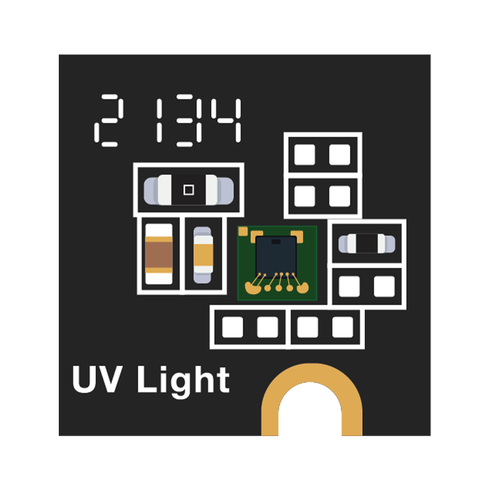
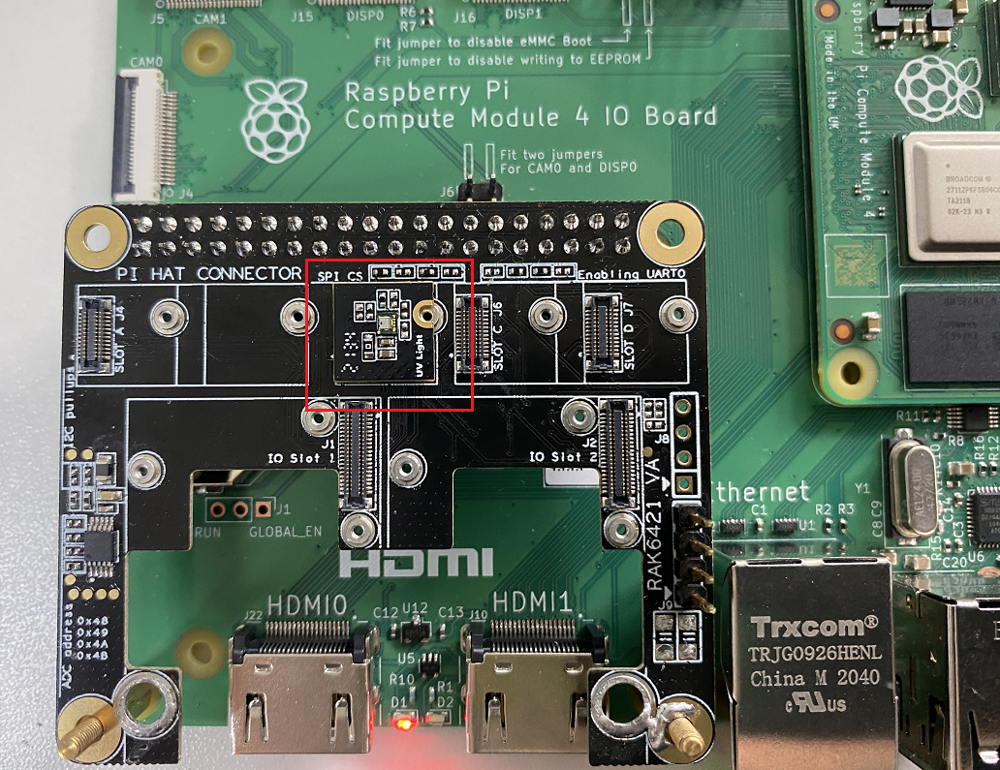

# Measure ambient light intensity and ultraviolet index using RAK12019 WisBlock UV Sensor

[TOC]

## 1.Introduction

This guide explains how to use the [WisBlock RAK12019 UV Sensor](https://docs.rakwireless.com/Product-Categories/WisBlock/RAK12019/Overview/) in combination with RAK6421 Wisblock Hat to measured ambient light intensity and ultraviolet index using Python. 

### 1.1. RAK12019 & LTR-390UV-01

The **RAK12019** is an Ambient Light Sensor (ALS) or Ultraviolet Light Sensor (UVS), which is part of the RAKwireless WisBlock sensor series. For more information about RAK12019, refer to the [Datasheet](https://docs.rakwireless.com/Product-Categories/WisBlock/RAK12019/Datasheet/). This module utilizes the **LTR-390UV-01** sensor from Lite-On. The LTR-390UV-01 is an integrated low voltage I2C ambient light sensor (ALS) and ultraviolet light sensor (UVS). This sensor converts light intensity to a digital output signal capable of direct 12C interface. The measured ambient light intensity and ultraviolet index are interfaced via the I2C bus making it immune to electrical noises, unlike its analog output counterpart. For more information about LTR-390UV-01, refer to the [Datasheet](https://www.mouser.com/datasheet/2/239/LTR-390UV_Final_%20DS_V1%201-1145336.pdf). 

### 1.2. I2C protocol

**I2C** (**Inter-Integrated Circuit**) is a synchronous, multi-controller/multi-target (controller/target), packet switched, single-ended, serial communication bus，it is widely used for attaching lower-speed peripheral ICs to processors and microcontrollers in short-distance, intra-board communication. The **LTR-390UV-01** utilized in RAK12019 supports the I2C serial bus, and it operates as a slave device on the I2C bus, its address is 0x53.  

## 2.Hardware

### 2.1. Hardware Preparation

In this example we will only need to connect RAK12019 to the high-density connector located on RAK6421 Wisblock Hat. For more information about **RAK12019**, refer to the [Datasheet](https://docs.rakwireless.com/Product-Categories/WisBlock/RAK12019/Overview/).

- RAK12019 WisBlock UV Sensor



The RAK12019 can be mounted on any one of the four slots on top of the RAK6421 Wisblock Hat. For example, it's mounted on J5 (slot B), as shown in the picture below. 



## 3. Software

### 3.1. Basic configuration

LTR-390UV-01 has a 7-bit slave address of 0x53, a read/write bit should be appended to the slave address by the master device to communicate with the device. The ALS_UVS_MEAS_RATE Register (Address: 0x40) is used to control ALS/UVS measurements resolution, gain settings and measurement rate. For details about how each register is configured, please check LTR-390UV-01's datasheet. in **ADS7830**'s [datasheet](https://optoelectronics.liteon.com/upload/download/DS86-2015-0004/LTR-390UV_Final_%20DS_V1%201.pdf). In the example code, LTR-390UV-01 is configured to run with the default configuration defined in the [Adafruit_CircuitPython_LTR390 library](https://github.com/adafruit/Adafruit_CircuitPython_LTR390) 

### 3.2. Example Code

The example code can be found in the [rak12019-read.py](rak12019-read.py) file. In order to run this you will first have to install some required modules. The recommended way to do this is to use [virtualenv](https://virtualenv.pypa.io/en/latest/) to create an isolated environment. To install `virtualenv` you just have to:

```
sudo apt install virtualenv
```

Once installed you can create the environment and install the dependencies (run this in the `rak12019-read` directory):

```
virtualenv .env
source .env/bin/activate
pip install -r requirements.txt
```

Once installed you can run the example by typing:

```
python rak12019-read.py
```

After that you can leave the virtual environment by typing `deactivate`. To activate the virtual environment again you just have to `source .env/bin/activate` and run the script. No need to install the dependencies again since they will be already installed in the virtual environment.
