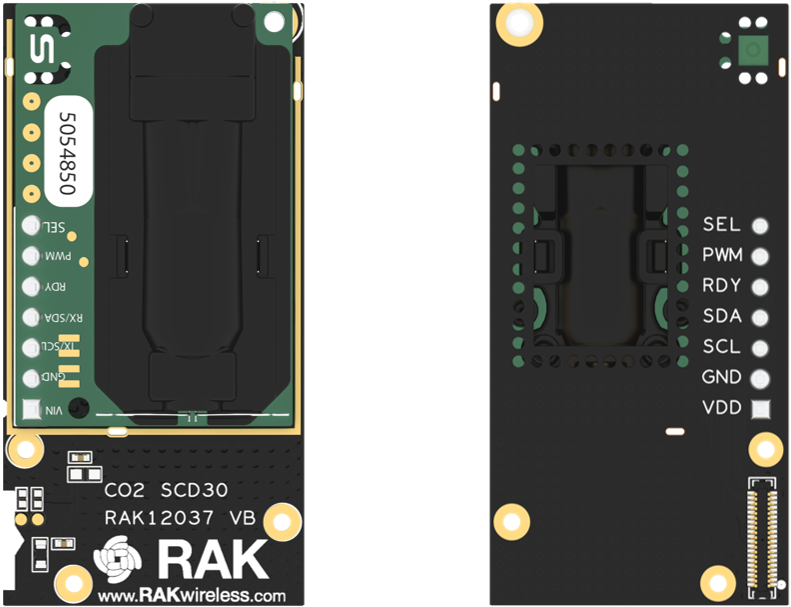
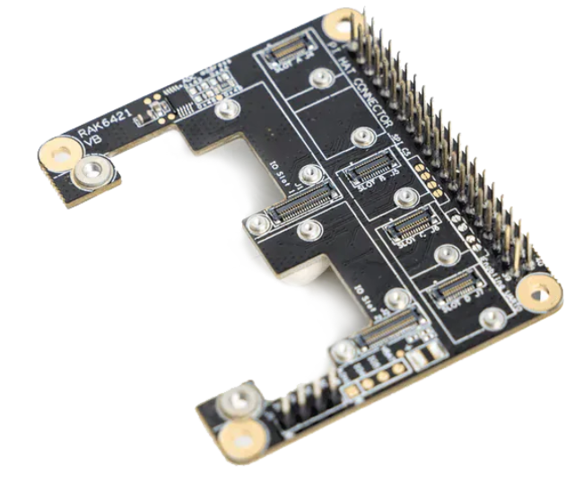
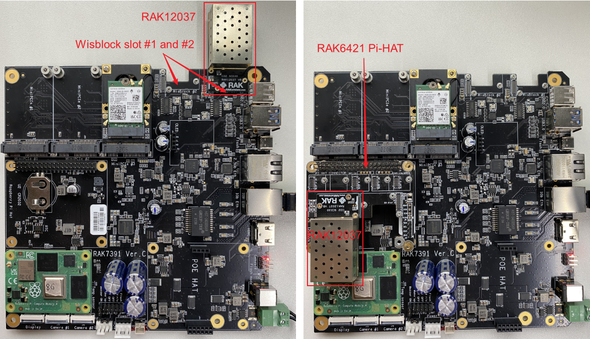
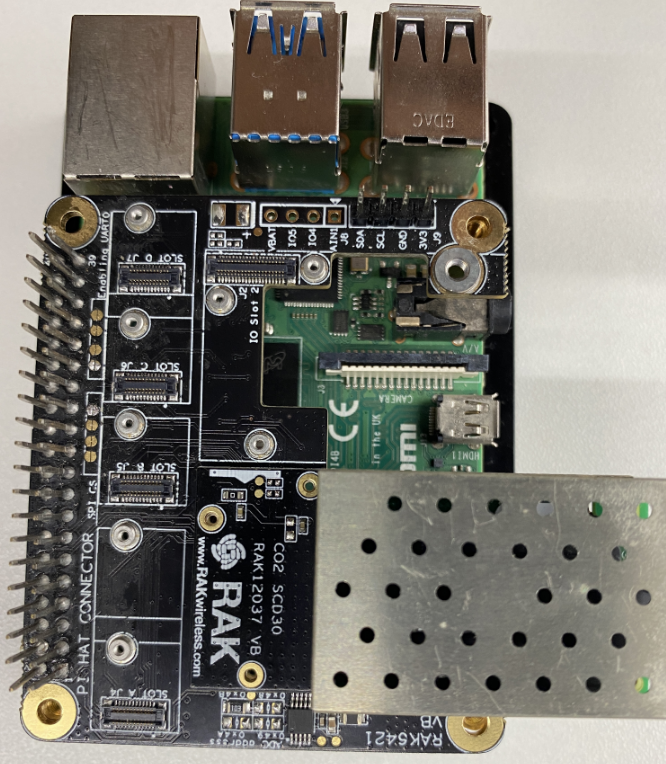

# Measure the concentration of CO2 with WisBlock sensor RAK12037 and Pi-Hat RAK6421

[TOC]

## 1. Introduction

This guide explains how to use the [WisBlock sensor RAK12037](https://store.rakwireless.com/products/co2-sensor-sensirion-scd30-rak12037) in combination with RAK6421 Pi-Hat to measure the concentration of CO2 in the air. 

## 2. Hardware

### 2.1. Sensor hardware

RAK12037 is a WisBlock Sensor that extends the WisBlock system based on the SCD30 module. This module uses NDIR CO2 sensor technology to sense CO2 and has an integrated temperature and humidity sensor. Ambient humidity and temperature can be measured by monitoring and compensating for external heat sources without the need for additional components. Its i2c address is `0x61`.



### 2.2. RAK6421 Pi-Hat

RAK6421 is a pi-hat  for Raspberry pi 3B/4B or RAK7391 which has 4 sensor slots and 2 IO slots of Wisblock. 



### 2.3. Connection diagram

There are two methods to establish a connection between the RAK12037 and the RAK7391. The first approach involves utilizing the on-board Wisblock slots on RAK7391, and both slots are fully functional for this purpose. The second option involves utilizing the RAK6421 Pi-HAT. It is important to note that, due to the over-sized enclosure, the RAK12037 can only be mounted on IO slot 1 on the RAK6421 Pi-HAT.

To ensure optimal functionality, it is recommended to carefully consider the available options and select the appropriate method that meets the requirements of the specific project. 



We can also connect RAK6421 to Raspberry pi 4B+.



## 3. Software

The example code can be found in the [rak12037-CO2-monitoring.py](https://github.com/RAKWireless/wisblock-python/blob/master/sensors/rak12037/rak12037-CO2-monitoring.py) file. We also have to install some required python modules. The recommended way to do this is to use [virtualenv](https://virtualenv.pypa.io/en/latest/) to create an isolated environment. If you don't have the `virtualenv` installed, please follow the steps shown below:

```
sudo apt install virtualenv
```

Once installed you can create the environment and install the dependencies (run this in the `rak12037` directory):

```
virtualenv .env
source .env/bin/activate
pip install -r requirements.txt
```

Once installed you can run the example by typing:

```
python rak12037-CO2-monitoring.py
```

The result should look like what is shown below :

```
CO2: 864.69ppm, temp: 25.77'C, rh: 23.24%
CO2: 866.43ppm, temp: 25.78'C, rh: 23.19%
CO2: 866.66ppm, temp: 25.78'C, rh: 23.21%
CO2: 868.39ppm, temp: 25.81'C, rh: 23.13%
CO2: 868.82ppm, temp: 25.83'C, rh: 23.19%
CO2: 869.48ppm, temp: 25.84'C, rh: 23.13%
CO2: 871.17ppm, temp: 25.85'C, rh: 23.12%
CO2: 873.83ppm, temp: 25.81'C, rh: 23.04%
```

After that you can leave the virtual environment by typing `deactivate`. To activate the virtual environment again you just have to `source .env/bin/activate` and run the script. No need to install the dependencies again since they will be already installed in the virtual environment.

## 4. License

We  share the project under MIT license.
