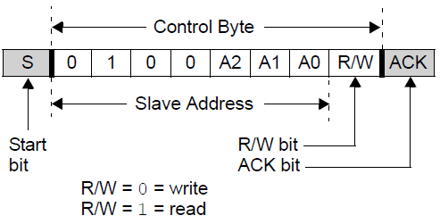
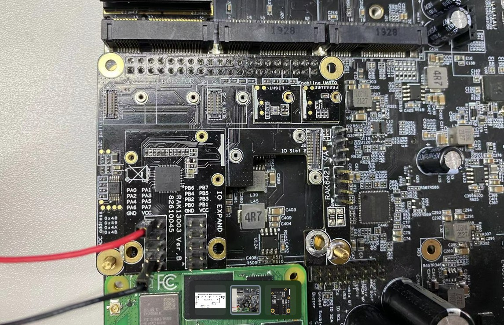
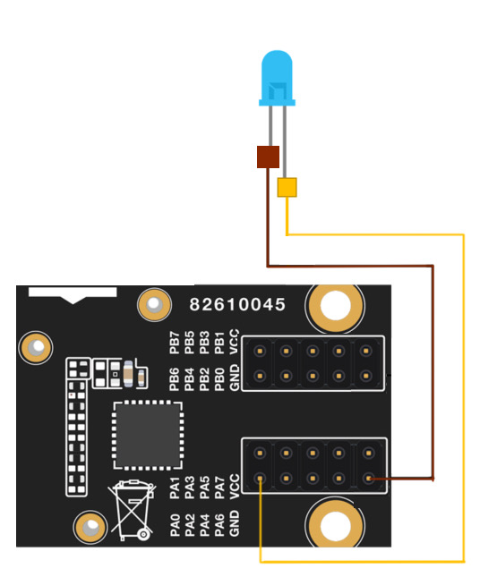

# Blink a LED connected RAK13003 WisBlock IO Expansion Module Using Python 

[TOC]

## 1.Introduction

This guide explains how to use the [RAK13003 WisBlock IO Expansion Module](https://docs.rakwireless.com/Product-Categories/WisBlock/RAK13003/Overview/) in combination with RAK6421 Wisblock Hat or RAK7391 to add 16 extra bidirectional I/O ports. 

### 1.1. RAK13003 & MCP23017

The **RAK13003** is an IO expansion module that can be mounted to IO slot of WisBlock Base board. Check [RAK13003's Datasheet](https://docs.rakwireless.com/Product-Categories/WisBlock/RAK13003/Overview/#product-description) for more details. RAK13003 offers 16 bidirectional I/O ports by using **MCP23017** IC from Microchip. The configuration of the module is via I2C interface and it supports both standard and fast I2C modes. Users can set each of 16 pins to be input, output, or input with a pull-up. It also provides the ability to get an interrupt via an external pin when any of the inputs change so you don't have to keep polling the chip. For more information about MCP23017, refer to the [Datasheet](https://www.mouser.com/datasheet/2/239/LTR-390UV_Final_%20DS_V1%201-1145336.pdf). 

### 1.2. I2C protocol

**I2C** (**Inter-Integrated Circuit**) is a synchronous, multi-controller/multi-target (controller/target), packet switched, single-ended, serial communication bus，it is widely used for attaching lower-speed peripheral ICs to processors and microcontrollers in short-distance, intra-board communication. The **MCP23017** utilized in RAK13003 supports the I2C serial bus, and it operates as a slave device on the I2C bus, its default address is 0x20.  The figure below sows its device addressing. By default A2, A1, and A0 are connected to ground. The address changes if you set any of the A0, A1, A2 # pins.




## 2.Hardware

### 2.1. Hardware Preparation

In this example we need to connect RAK13003 to the high-density connector located on RAK6421 Wisblock Hat or RAK7391 first. 

- RAK13003 WisBlock IO Expansion Module


The RAK12019 can be mounted on either IO slot of the RAK6421 Wisblock Hat and RAK7391's Wisblock slot. For example, it can be mounted on J1 (slot B) on RAK6421 Wisblock Hat, as shown in the picture below. 



You also need a LED and two jumper wires, so that you can connect the LED to RAK13003. Notice that the the anode (long leg) should goes to any pin from PA0 to PA7 and also PB0 to PB7, while the cathode(short leg) should connect to either one of the GND pin on RAK13003. For example, if we want to blink the LED connected to PA0 (pin 0), we can connect the wires to RAK13003 as shown in the figure below. 



## 3. Software

### 3.1. Basic configuration

MCP23017 on RAK13003 has a 7-bit slave address of 0x20, a read/write bit should be appended to the slave address by the master device to communicate with the device. MCP23017 has a reset pin, users need to pull the pin to low to rest the chip. When the RAK13003 is mounted on RAK6421's slot 1, the reset pin is gpio 16 (board pin 36); when RAK13003 is mounted to slot 2, the reset pin is gpio 24 (board pin 18 ).

Users also need to specify a pin number from # 0 to 15 for the GPIOA0...GPIOA7, GPIOB0...GPIOB7 pins (i.e. pin 12 is GPIOB4). For more information about the API usages documentations, please check [Adafruit MCP230xx Library](https://docs.circuitpython.org/projects/mcp230xx/en/latest/#).

### 3.2. Example Code

The example code can be found in the [rak13003-blink.py](rak13003-blink.py) file. In order to run this you will first have to install some required modules. The recommended way to do this is to use [virtualenv](https://virtualenv.pypa.io/en/latest/) to create an isolated environment. To install `virtualenv` you just have to:

```
sudo apt install virtualenv
```

Once installed you can create the environment and install the dependencies (run this in the `rak13003-blink` directory):

```
virtualenv .env
source .env/bin/activate
pip install -r requirements.txt
```

Once installed you can run the example by typing:

```
python rak13003-blink.py
```
You will see the led conncted to RAK13003 is blinking with the frequency of 1 Hz for 5 seconds.
After that you can leave the virtual environment by typing `deactivate`. To activate the virtual environment again you just have to `source .env/bin/activate` and run the script. No need to install the dependencies again since they will be already installed in the virtual environment.
