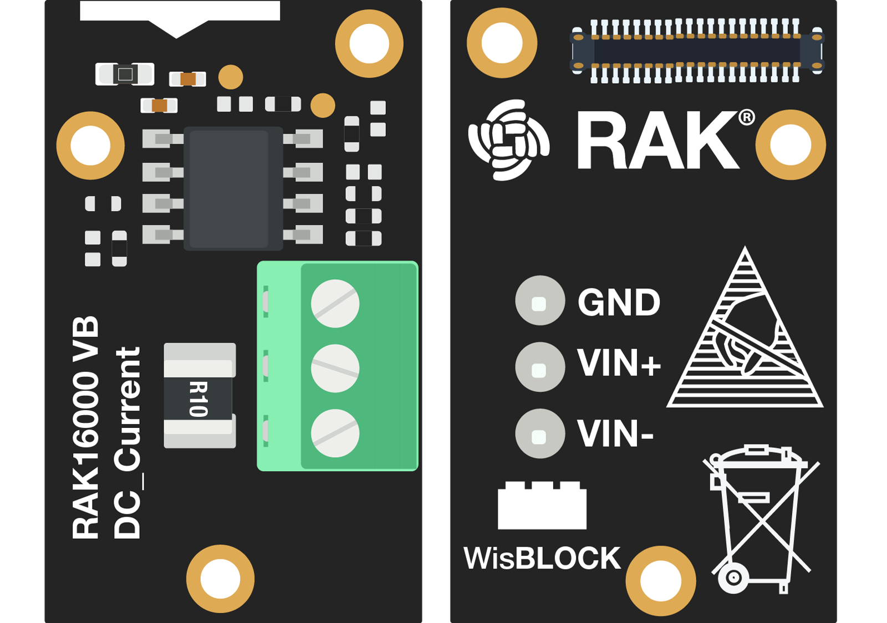
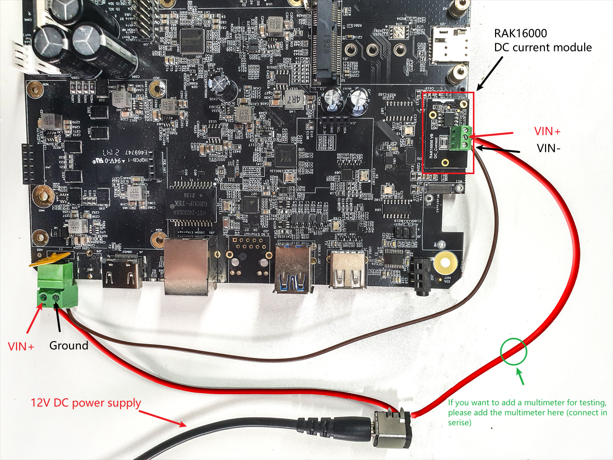

# Measuring DC current using using WisBlock sensor RAK16000

[TOC]

## 1.Introduction

This guide explains how to use the [WisBlock IO RAK16000](https://docs.rakwireless.com/Product-Categories/WisBlock/RAK16000/Overview/) in combination with RAK6421 Wisblock Hat or RAK7391 WisGate Developer Connect to measure DC current through I2C interface using Python. 

### 1.1 RAK16000

**RAK16000** is a part of the WisBlock Sensor Series that is capable of measuring DC current in the range of 0 to 3 A in a voltage range of 0 to 26 V. With the two measured DC values, you get the power consumption by multiplying the current and voltage. Additionally, this module uses the [INA219BID](https://www.ti.com/store/ti/en/p/product/?p=INA219BID) from Texas Instruments that offers high accuracy maximum rate of 0.5% over temperature.

The INA219 is a current shunt and power monitor with an I2C- or SMBUS-compatible interface. The device monitors both shunt voltage drop and bus supply voltage, with programmable conversion times and filtering. A programmable calibration value, combined with an internal multiplier, enables direct readouts of current in amperes. An additional multiplying register calculates power in watts. The I2C- or SMBUS-compatible interface features 16 programmable addresses. For more information about **INA219BID**, refer to the [Datasheet](https://www.ti.com/lit/ds/symlink/ina219.pdf?ts=1647401885343&ref_url=https%253A%252F%252Fwww.ti.com%252Fproduct%252FINA219).

### 1.2. I2C protocol

**I2C** (**Inter-Integrated Circuit**) is a synchronous, multi-controller/multi-target (controller/target), packet switched, single-ended, serial communication bus invented in 1982 by Philips Semiconductors. It is widely used for attaching lower-speed peripheral ICs to processors and microcontrollers in short-distance, intra-board communication. The **INA219BID** supports the I2C serial bus and data transmission protocol, and it operates as a slave device on the I2C bus.  

## 2.Hardware

### 2.1. Sensor hardware

In this example we use RAK16000 to measure the power consumption of RAK7391 WisGate Developer board. We need to connect RAK16000 in series with the phoenix contact (terminal block) on RAK7391 board and then connect RAK16000 to the high-density connector located on RAK6421 Wisblock Hat or RAK7391 WisGate Developer board. For more information about **RAK16000**, refer to the [Datasheet](https://docs.rakwireless.com/Product-Categories/WisBlock/RAK16000/Datasheet/).

- RAK16000 WisBlock DC Current Module



### 2.2. Other hardware

You will need a couple of cables to connect RAK16000 with the phoenix contact (terminal block) on the RAK7391 board. You might also need a multimeter for testing.

### 2.3. Connection diagram

In the following figure, we show you how RAK16000 is connected to RAK7391 board and the phoenix contact (terminal block). 



Notice that if you want to add a multimeter to the circuit above, you need to connected it in series with the VIN+ pin on RAK16000. For example, cut the red cable used to connected the power supply and the VIN+ pin (highlighted in green in above figure), and then connect you multimeter in series. 

## 3. Software

### 3.1. Chip configuration

RAK16000 has a 100 mΩ (0.1 Ω) shunt resistor placed between the power supply and the load, and the default 7-bit I2C address is set to 0x41.

The python library [pi-ina219](https://pypi.org/project/pi-ina219/) is used in this example. This library offers several modes for user to monitor voltage, current, and power consumption: simple-auto gain mode, advanced-auto gain & high resolution mode, and advanced-manual gain & high resolution mode. This example code uses the simple-auto gain mode, it will provide valid readings until the device current capability is exceeded for the value of the shunt resistor connected (3.2A for 0.1Ω shunt resistor).

### 3.2. Example Code

The example code can be found in the [rak16000-power-monitoring.py](**rak16000-power-monitoring.py**) file. In order to run this you will first have to install some required modules. The recommended way to do this is to use [virtualenv](https://virtualenv.pypa.io/en/latest/) to create a isolated environment. To install `virtualenv` you just have to:

```
sudo apt install virtualenv
```

Once installed you can create the environment and install the dependencies (run this on the `rak16000` folder):

```
virtualenv .env
source .env/bin/activate
pip install -r requirements.txt
```

Once installed you can run the example by typing:

```
python rak16000-power-monitoring.py
```

After that you can leave the virtual environment by typing `deactivate`. To activate the virtual environment again you just have to `source .env/bin/activate` and run the script. No need to install the dependencies again since they will be already installed in the virtual environment.
