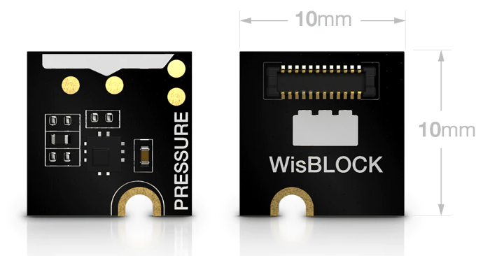
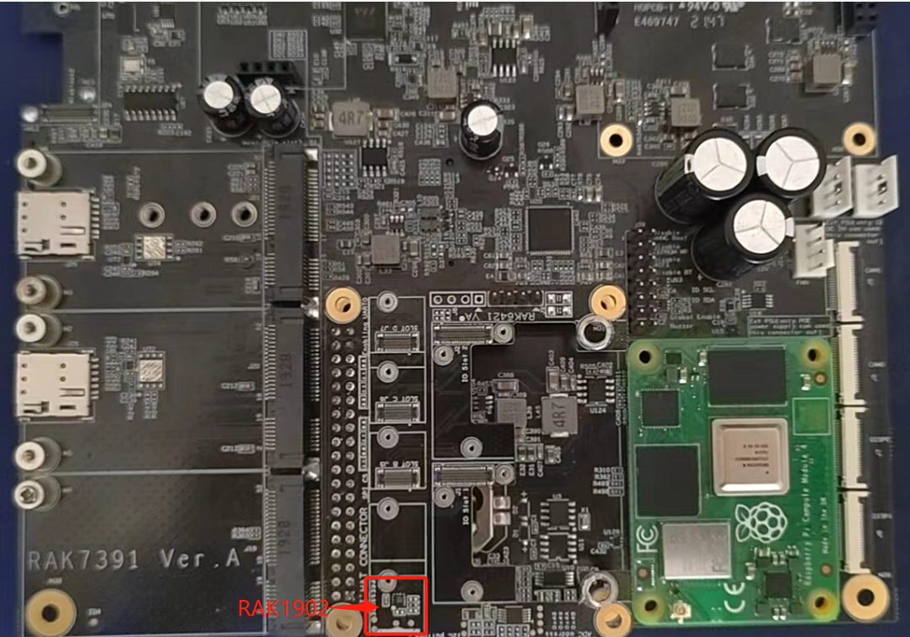

# Monitor barometric pressure with WisBlock sensor RAK1902 and Pi-Hat RAK6421 and RAK7391

[TOC]

## 1. Introduction

This guide explains how to use the [WisBlock sensor RAK1902](https://store.rakwireless.com/products/rak1902-kps22hb-barometric-pressure-sensor?_pos=1&_sid=9a186c444&_ss=r) in combination with RAK6421 Pi-Hat to monitor environment using Python. 

## 2. Hardware

### 2.1. Sensor hardware

RAK1902 is a WisBlock Sensor which extends the WisBlock system with a barometric pressure sensor.  Its i2c address is `0x5C`.



 

### 2.2. RAK6421 Pi-Hat

RAK6421 is a pi-hat  for Raspberry pi 3B/4B or RAK7391 which has 4 sensor slots and 2 IO slots of Wisblock. 


### 2.3. Connection diagram

Firstly, connect RAK1902  to RAK6421 board. And then connect RAK6421 to RAK7391.



We can also connect RAK6421 to Raspberry pi 4B+.

## 3. Software

The example code can be found in the [rak902-read.py](https://git.rak-internal.net/product-rd/gateway/wis-developer/rak7391/wisblock-python/-/tree/dev/sensors/rak1902/rak1902-read) file. In order to run this you will first have to install some required modules. The recommended way to do this is to use [virtualenv](https://virtualenv.pypa.io/en/latest/) to create an isolated environment. To install `virtualenv` you just have to:

```
sudo apt install virtualenv
```

Once installed you can create the environment and install the dependencies (run this in the `rak1902-read` directory):

```
virtualenv .env
source .env/bin/activate
pip install -r requirements.txt
```

Once installed you can run the example by typing:

```
python rak1902-read.py
```

The result will be as below:

```
Pressure: 974.96 hPa
Temperature: 24.94 C
```

After that you can leave the virtual environment by typing `deactivate`. To activate the virtual environment again you just have to `source .env/bin/activate` and run the script. No need to install the dependencies again since they will be already installed in the virtual environment.

## 4. License

Thanks for [adafruit's Adafruit_CircuitPython_LPS2X library](https://github.com/adafruit/Adafruit_CircuitPython_LPS2X). We also share the project under MIT license.
