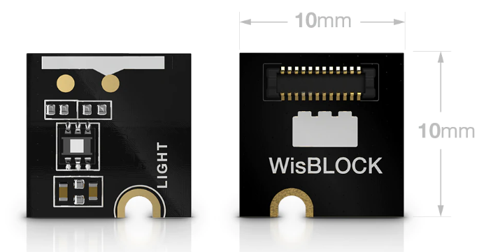
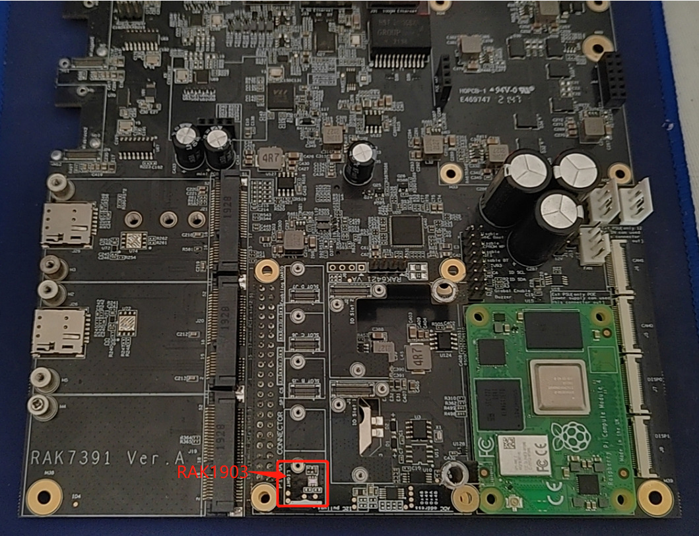

# Monitor ambient light with WisBlock sensor RAK1903 and Pi-Hat RAK6421 and RAK7391

[TOC]

## 1. Introduction

This guide explains how to use the [WisBlock sensor RAK1903](https://store.rakwireless.com/products/rak1903-opt3001dnpr-ambient-light-sensor) in combination with RAK6421 Pi-Hat to monitor ambient light using Python. 

## 2. Hardware

### 2.1. Sensor hardware

RAK1903 is a WisBlock Sensor which extends the WisBlock system with an ambient light sensor. Its i2c address is `0x44`.



### 2.2. RAK6421 Pi-Hat

RAK6421 is a pi-hat  for Raspberry pi 3B/4B or RAK7391 which has 4 sensor slots and 2 IO slots of Wisblock. 


### 2.3. Connection diagram

Firstly, connect RAK1903 to RAK6421 board. And then connect RAK6421 to RAK7391.



We can also connect RAK6421 to Raspberry pi 4B+.

## 3. Software

The example code can be found in the [rak903-read.py](https://git.rak-internal.net/product-rd/gateway/wis-developer/rak7391/wisblock-python/-/tree/dev/sensors/rak1903/rak1903-read) file. The example relies on python3-smbus library, so we install it firstly.

```
sudo apt install python3-smbus
```

we also have to install some required python modules. The recommended way to do this is to use [virtualenv](https://virtualenv.pypa.io/en/latest/) to create an isolated environment. To install `virtualenv` you just have to:

```
sudo apt install virtualenv
```

Once installed you can create the environment and install the dependencies (run this in the `rak1903-read` directory):

```
virtualenv .env
source .env/bin/activate
pip install -r requirements.txt
```

Once installed you can run the example by typing:

```
python rak1903-read.py
```

The result will be as below:

```
Ambient light: 40.76 lux
Ambient light: 40.56 lux
Ambient light: 40.76 lux
Ambient light: 40.77 lux
Ambient light: 40.77 lux
Ambient light: 40.75 lux
Ambient light: 40.730000000000004 lux
Ambient light: 40.72 lux
Ambient light: 40.75 lux
Ambient light: 40.9 lux
Ambient light: 41.02 lux
Ambient light: 41.12 lux
Ambient light: 41.18 lux
```

After that you can leave the virtual environment by typing `deactivate`. To activate the virtual environment again you just have to `source .env/bin/activate` and run the script. No need to install the dependencies again since they will be already installed in the virtual environment.

## 4. License

We  share the project under MIT license.
