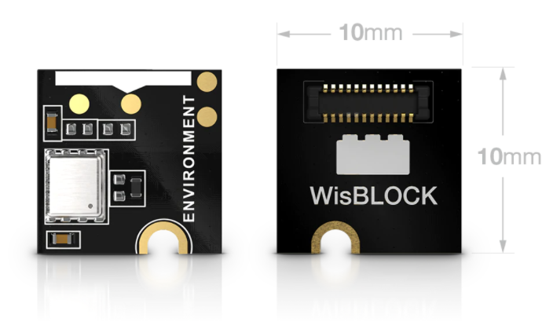
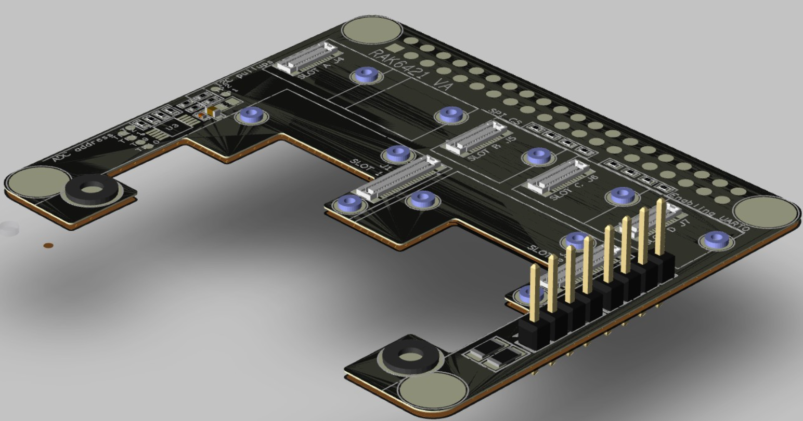
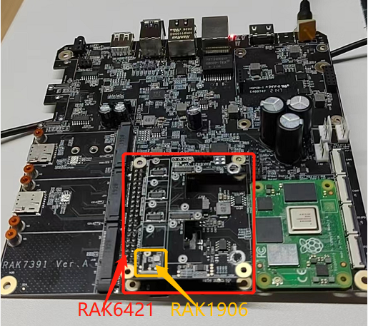
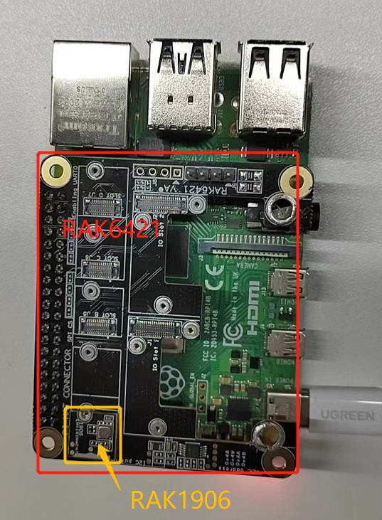

# Monitor environment with WisBlock sensor RAK1906 and Pi-Hat RAK6421 and RAK7391

[TOC]

## 1. Introduction

This guide explains how to use the [WisBlock sensor RAK1906](https://store.rakwireless.com/products/rak1906-bme680-environment-sensor?_pos=1&_sid=3f533e89b&_ss=r) in combination with RAK6421 Pi-Hat to monitor environment using Python. 

## 2. Hardware

### 2.1. Sensor hardware

WisBlock sensor RAK1906 uses the Bosch BME680 environment sensor which integrates high-linearity and high-accuracy gas, pressure, humidity and temperature sensors.



 

### 2.2. RAK6421 Pi-Hat

RAK6421 is a pi-hat  for Raspberry pi 3B/4B or RAK7391 which has 4 sensor slots and 2 IO slots of Wisblock. 




### 2.3. Connection diagram

Firstly, connect RAK1906  to RAK6421 board. And then connect RAK6421 to RAK7391.



We can also connect RAK6421 to Raspberry pi 4B+.



## 3. Software

The example code can be found in the [**read-all.py**](https://git.rak-internal.net/product-rd/gateway/wis-developer/rak7391/wisblock-python/-/tree/dev/sensors/rak1906/rak1906-read-all) file. In order to run this， you will first have to install some required modules. 

The recommended way to do this is to use [virtualenv](https://virtualenv.pypa.io/en/latest/) to create an isolated environment. To install `virtualenv` you just have to:

```
sudo apt install virtualenv
```

Once installed you can create the environment and install the dependencies (run this on the `rak1906/rak1906-read-all` folder):

```
virtualenv .env
source .env/bin/activate
pip install -r requirements.txt
```

Once installed you can run the example by typing:

```
python read-all.py
```

The logs will be show as follows if all is OK.

```
Press Ctrl+C to exit!


Calibration data:
par_gh1: -67
par_gh2: -6701
par_gh3: 18
par_h1: 813
par_h2: 1003
par_h3: 0
par_h4: 45
par_h5: 20
par_h6: 120
par_h7: -100
par_p1: 37076
par_p10: 30
par_p2: -10178
par_p3: 88
par_p4: 9797
par_p5: -276
par_p6: 30
par_p7: 50
par_p8: -3663
par_p9: -2181
par_t1: 26012
par_t2: 26672
par_t3: 3
range_sw_err: 2
res_heat_range: 1
res_heat_val: 31
t_fine: 144517


Initial reading:
gas_index: 0
gas_resistance: 2818372.1335852873
heat_stable: False
humidity: 32.265
meas_index: 0
pressure: 961.17
status: 32
temperature: 28.23


Polling:
28.23 C,961.15 hPa,32.29 %RH
28.26 C,961.16 hPa,32.27 %RH,2384.5133 Ohms
28.33 C,961.15 hPa,32.22 %RH,2983.0609 Ohms
28.40 C,961.18 hPa,32.15 %RH,3564.4805 Ohms
28.47 C,961.16 hPa,32.06 %RH,4160.7143 Ohms
28.54 C,961.18 hPa,31.95 %RH,4778.1648 Ohms
28.61 C,961.17 hPa,31.85 %RH,5436.4703 Ohms
28.67 C,961.16 hPa,31.74 %RH,6017.6390 Ohms
28.73 C,961.19 hPa,31.66 %RH,6656.9101 Ohms
28.78 C,961.16 hPa,31.57 %RH,7323.8015 Ohms
28.82 C,961.16 hPa,31.49 %RH,7912.8365 Ohms
28.85 C,961.19 hPa,31.41 %RH,8473.3176 Ohms
28.88 C,961.17 hPa,31.33 %RH,8994.5881 Ohms
28.91 C,961.19 hPa,31.26 %RH,9497.7311 Ohms
28.93 C,961.17 hPa,31.18 %RH,9890.3631 Ohms
28.95 C,961.17 hPa,31.14 %RH,10296.6765 Ohms
28.97 C,961.18 hPa,31.07 %RH,10705.0472 Ohms
28.99 C,961.21 hPa,31.02 %RH,11076.7720 Ohms
29.00 C,961.19 hPa,30.98 %RH,11413.0353 Ohms
29.01 C,961.20 hPa,30.93 %RH,11765.0008 Ohms
29.01 C,961.19 hPa,30.89 %RH,12067.8626 Ohm
```

After that， you can leave the virtual environment by typing `deactivate`. To activate the virtual environment again you just have to `source .env/bin/activate` and run the script. No need to install the dependencies again since they will be already installed in the virtual environment.


## 4. License

Thanks for [pimoroni's bme680-python library](https://github.com/pimoroni/bme680-python). We also share the project under MIT license.
