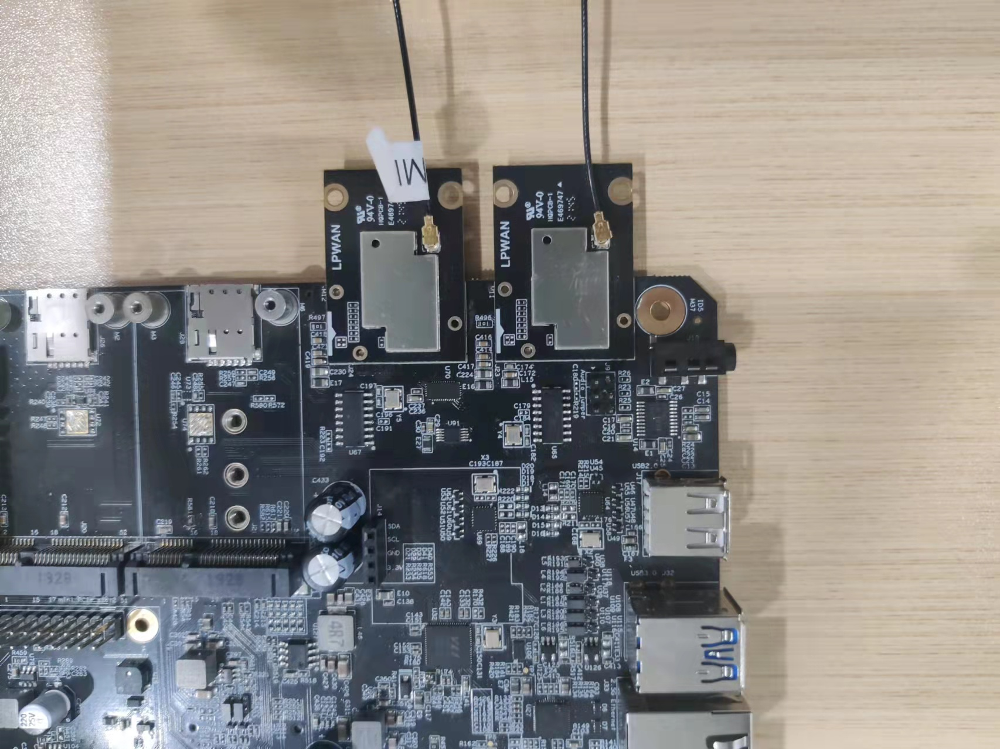

# LoRa point to point communication with WisBlock RAK13300 

[TOC]

## 1. Introduction

This guide explains how to use the [RAK13300 WisBlock LPWAN Wireless Module](https://docs.rakwireless.com/Product-Categories/WisBlock/RAK13300/Overview/) in combination with RAK7391 to build a LoRa point to point communication using Python. 

### 1.1 RAK13300

The RAK13300 is a LoRa module based on the SX1262 LoRa chip. It provides an easy-to-use, small-size, and low-power solution for long-range wireless data applications. the module complies with LoRaWAN standards and supports LoRa point-to-point communication. For more information about RAK13300, refer to the [Datasheet](https://docs.rakwireless.com/Product-Categories/WisBlock/RAK13300/Datasheet/).

## 2. Hardware

### 2.1. Hardware preparation

In this example, we need two RAK13300 modules to communicate, one as transmitter and the other as receiver.   the RAK13300 can be mounted to two WisBlock IO Slots on the RAK7391.

- RAK13300 * 2
- RAK7391 *2

### 2.2. Connection diagram



## 3. Software

The transmitter code can be found in the [transmitter.py](transmitter.py) file, receiver code can be found in the [receiver.py](receive.py) file. In order to run this you will first have to install some required modules. The recommended way to do this is to use [virtualenv](https://virtualenv.pypa.io/en/latest/) to create a isolated environment. To install `virtualenv` you just have to:

```plaintext
sudo apt install virtualenv
```

Once installed you can create the environment and install the dependencies (run this on the `rak13300-p2p` folder):

```plaintext
virtualenv .env
source .env/bin/activate
pip install -r requirements.txt
```

Once installed you can run the transmitter code in one of boards by typing:

```plaintext
python transmitter.py
```

and run the receiver code in another board by typing:

```
python receiver.py
```

The output result on the transmitter side will be:

```
Begin LoRa radio
Set RF module to use TCXO as clock reference
Set frequency to 915 Mhz
Set TX power to +17 dBm
Set modulation parameters:
	Spreading factor = 7
	Bandwidth = 125 kHz
	Coding rate = 4/5
Set packet parameters:
	Explicit header type
	Preamble length = 12
	Payload Length = 15
	CRC on
Set syncronize word to 0x3444

-- LoRa Transmitter --

HeLoRa World!  0
Transmit time: 73.77 ms | Data rate: 203.34 byte/s
HeLoRa World!  1
Transmit time: 73.74 ms | Data rate: 203.42 byte/s
HeLoRa World!  2
Transmit time: 73.79 ms | Data rate: 203.27 byte/s
HeLoRa World!  3
Transmit time: 73.87 ms | Data rate: 203.06 byte/s
```


The output result on the receiver side will be:

```
Begin LoRa radio
Set RF module to use TCXO as clock reference
Set frequency to 915 Mhz
Set RX gain to power saving gain
Set modulation parameters:
	Spreading factor = 7
	Bandwidth = 125 kHz
	Coding rate = 4/5
Set packet parameters:
	Explicit header type
	Preamble length = 12
	Payload Length = 15
	CRC on
Set syncronize word to 0x3444

-- LoRa Receiver --

HeLoRa World!  0
Packet status: RSSI = -91.00 dBm | SNR = -2.00 dB
HeLoRa World!  1
Packet status: RSSI = -90.00 dBm | SNR = 0.50 dB
HeLoRa World!  2
Packet status: RSSI = -89.00 dBm | SNR = -0.50 dB
HeLoRa World!  3
Packet status: RSSI = -89.00 dBm | SNR = 0.00 dB
```

After that you can leave the virtual environment by typing `deactivate`. To activate the virtual environment again you just have to `source .env/bin/activate` and run the script. No need to install the dependencies again since they will be already installed in the virtual environment.

## 4. License

We  share the project under MIT license.
